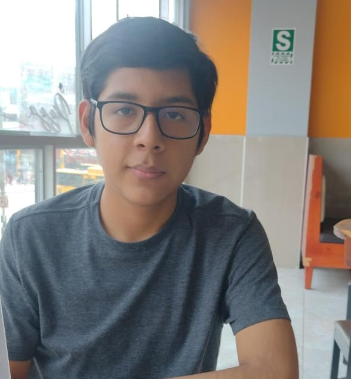
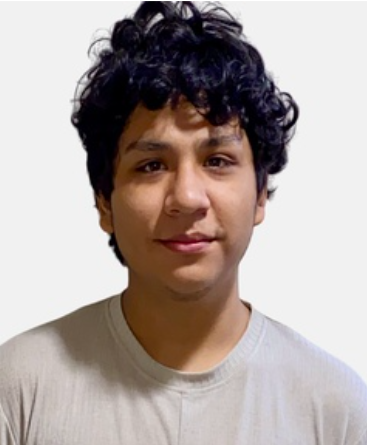

## **Capítulo I:  Presentación**
  - **1.1. Startup Profile** 
  Esta sección incluye la descripción del Startup y los perfiles de los integrantes del equipo.
    - **1.1.1. Descripción de la Startup**  
    En **“AlguienDijoChamba”** hemos desarrollado una plataforma digital que conecta de forma rápida y segura a usuarios con técnicos especializados en oficios como fontanería, electricidad, carpintería, limpieza y otros servicios del hogar. 

      A través de una aplicación y página web intuitiva, los clientes pueden encontrar profesionales confiables, recibir atención prioritaria y acceder a beneficios exclusivos mediante un sistema de gamificación (niveles Bronce, Plata y Oro). Por su parte, los técnicos reciben pagos inmediatos al finalizar cada servicio, lo que genera confianza, compromiso y dinamismo en la comunidad. 

    
    
<strong>Misión:</strong> Facilitar el acceso a servicios técnicos confiables y de calidad, conectando a usuarios con profesionales especializados mediante una plataforma eficiente, segura y transparente, que valore el trabajo de los técnicos y ofrezca beneficios prácticos a los clientes.

    
<strong>Visión:</strong> Convertirnos en la plataforma líder en Latinoamérica para la contratación de servicios técnicos del hogar, reconocida por la confianza, rapidez y sostenibilidad de nuestro modelo, generando oportunidades de trabajo dignas y una experiencia superior para los usuarios.

    - **1.1.2. Perfiles de integrantes del equipo**

|                       Photo                        | Description |
|:--------------------------------------------------:|:------------|
|  | **Nombre y Apellido:** Diego Martin Bastidas Bastidas    **Carrera:** Ingeniería de Software (8vo ciclo)   **Acerca de:** Decidí estudiar esta carrera porque desde pequeño me llamaba la atención el funcionamiento de las computadoras y los procesos que conllevan. Me apasiona practicar deportes de contacto, salir a pasear y, sobre todo, ser Groomer canino, ya que disfruto trabajar con mascotas. |
|  | **Nombre y Apellido:** Fabrisio Belahonia Miranda   **Carrera:** Ingeniería de Software (7mo ciclo)   **Acerca de:** Me considero una persona responsable, ordenada y empática. Me interesa el área de Ciberseguridad y tengo experiencia en Linux, Redes y Cloud, lo que complementa mi formación académica y fortalece mi perfil técnico. |
|  | **Nombre y Apellido:** Rafael Alexander Dominguez Vargas    **Carrera:** Ingeniería de Software (6to ciclo)   **Acerca de:** Soy una persona responsable y empática. Poseo conocimientos en lenguajes de programación como C++, Java y Python, lo que me permite desarrollar soluciones diversas dentro de mi formación en Ingeniería de Software. |
|  | **Nombre y Apellido:** Sebastian Escobar Palomino    **Carrera:** Ingeniería de Software   **Acerca de:** Me comprometo a contribuir al máximo en el grupo y cumplir con las entregas dentro del plazo establecido. Busco mantener una comunicación efectiva con mis compañeros y aplicar mis habilidades para el desarrollo de las tareas asignadas en este proyecto. |
|  | **Nombre y Apellido:** Percy Alonso Muñiz Huayanca   **Carrera:** Ingeniería de Software   **Acerca de:** Soy una persona responsable, creativa y empática, cualidades que me permiten establecer buenas conexiones con quienes me rodean. Valoro el trabajo en equipo porque me da la oportunidad de compartir ideas y aprender de otras perspectivas. Tengo conocimientos en C++, HTML, CSS, entre otros, y me apasiona el Frontend y el Diseño UX. |

  - **1.2. Solution Profile**
    - **1.2.1 Antecedentes y problemática**
        - What (¿Qué?) AlguienDijoChamba es una aplicación que conecta a usuarios con especialistas en oficios como plomería, carpintería, electricidad, entre otros servicios que suelen ser difíciles de encontrar. Además, incorpora un sistema de gamificación con niveles (Bronce, Plata y Oro) que premia la fidelidad de los clientes y motiva a los técnicos a brindar un mejor servicio.
        - Who (¿Quién?) 
El servicio se lanzará inicialmente en áreas urbanas con alta demanda de mantenimiento del hogar y buena conectividad a internet, con una proyección de expansión a nivel nacional e internacional conforme aumente la comunidad de usuarios y profesionales registrados.  
        - Where (¿Dónde?) 
El desarrollo y validación de la plataforma está planificado a corto plazo, con una versión beta disponible en los próximos meses. El lanzamiento oficial tendrá lugar una vez culminada la fase de pruebas con usuarios y técnicos certificados.  
        - When (¿Cuándo?) 
El lanzamiento está previsto tras culminar la fase beta, en un plazo aproximado de meses.  
        - Why (¿Por qué?) 
La necesidad de servicios técnicos confiables es alta, pero encontrar especialistas disponibles sigue siendo un reto, sobre todo en oficios poco comunes. AlguienDijoChamba responde a esta problemática con una plataforma eficiente y práctica, que además fomenta la confianza y la fidelidad mediante un sistema de gamificación (niveles Bronce, Plata y Oro).  
        - How (¿Cómo?) 
A través de una aplicación intuitiva, los usuarios pueden localizar y contactar profesionales verificados según su ubicación y necesidad. Los técnicos reciben pagos inmediatos al finalizar cada servicio, lo que fortalece la confianza y el compromiso en la comunidad.  
        - How much (¿Cuánto?) 
El modelo free de AlguienDijoChamba brindará acceso gratuito a usuarios y profesionales, generando ingresos por comisiones de los servicios concretados en la app. Adicionalmente, se ofrecerá un plan premium con beneficios exclusivos para clientes frecuentes y técnicos destacados dentro del sistema de gamificación.  

    - **1.2.2 Lean UX Process**

        - **1.2.2.1. Lean UX Problem Statements** Nuestro producto fue diseñado para conectar a personas con profesionales especializados en oficios técnicos, mediante una plataforma eficiente, confiable y de fácil uso.Hemos observado que muchas personas aún enfrentan dificultades para encontrar rápidamente profesionales disponibles en su zona, lo cual genera frustración y pérdida de tiempo en situaciones que requieren soluciones urgentes.
        - **1.2.2.2. Lean UX Assumptions** 

          ### **Features**
          ---  
          Búsqueda de profesionales filtrados por especialidad, ubicación y reputación:
          Los usuarios valoran poder encontrar técnicos confiables y disponibles cerca de su ubicación de forma rápida y sencilla.  

          **Sistema de calificaciones y comentarios:**  
          Los usuarios necesitan referencias para tomar decisiones más seguras al contratar un profesional.  

          **Agenda de disponibilidad y contactos:**  
          Los usuarios valoran el poder agendar servicios de forma directa, pues les permite acelerar la contratación.  

          **Modelo freemium con opción premium:**  
          Los usuarios están dispuestos a pagar por funciones adicionales si perciben valor y utilidad concreta.    
          ### **Business Outcomes**
          ---  
          Aumentar la cantidad de contrataciones de servicios técnicos a través de la plataforma.  
          Mejorar la retención y la frecuencia de uso de los usuarios.  
          Generar ingresos sostenibles mediante comisiones por servicios y suscripciones premium.  
          Posicionar a **AlguienDijoChamba** como una solución confiable e innovadora en el mercado de servicios técnicos.    
          ### **Users**  
          ---
          Personas entre 25 y 50 años con hogares en áreas urbanas.  
          Pequeñas empresas que necesitan soporte técnico confiable.  
          Profesionales independientes que buscan más oportunidades de trabajo.    

          ### **User Outcomes & Benefit**
          ---  
          Encontrar profesionales técnicos de forma rápida y sencilla desde una sola plataforma.  
          Tener más confianza al contratar gracias a calificaciones, comentarios y perfiles completos.  
          Reducir la frustración y el tiempo perdido buscando técnicos confiables.  
          Acceder a un sistema de agenda práctica que agiliza el proceso de contratación.  

          ### **User Assumptions**
          ---  
          Los usuarios desean un catálogo organizado y fácil de usar.  
          Confían más en técnicos con buena reputación, comentarios positivos y ejemplos de trabajos previos.  
          Prefieren aplicaciones intuitivas que les ahorren tiempo y esfuerzo.  
          Están dispuestos a pagar un plan premium si perciben beneficios adicionales.  

          ### **Business Assumptions**  
          ---
          La demanda de servicios técnicos confiables seguirá creciendo en zonas urbanas.  
          Los usuarios adoptarán la plataforma si esta ofrece seguridad, rapidez y confianza.  
          Los técnicos independientes verán valor en registrarse para ampliar su base de clientes.  
          Un modelo freemium con opción premium será sostenible a largo plazo.  
      - **1.2.2.3. Lean UX Hypothesis Statements**    
      **Hipótesis 1:**  
      Creemos que al ofrecer una plataforma con búsqueda filtrada por especialidad, ubicación, calificación y ejemplos de trabajos anteriores, para usuarios residenciales entre 25 y 50 años que necesitan encontrar técnicos confiables rápidamente, obtendremos una mejora en la tasa de concretación de servicios y mayor satisfacción del usuario.  
      **Sabremos que esta hipótesis es cierta**  
      Cuando veamos que al menos el 60% de los usuarios que usan los filtros completan una solicitud de servicio, y más del 80% califican positivamente la experiencia.    
      
        **Hipótesis 2:**  
      Creemos que mostrar calificaciones, comentarios y tarifas aproximadas en los perfiles de técnicos, para usuarios que desean mayor confianza y transparencia al contratar servicios, obtendremos un aumento en la confianza y reducción de la tasa de abandono de la plataforma.  
      **Sabremos que esta hipótesis es cierta**  
      Cuando veamos que la tasa de contacto con profesionales aumente al menos un 40% después de visualizar perfiles completos.  
      
        **Hipótesis 3:**  
      Creemos que al permitir que los usuarios agenden directamente una cita con el profesional desde la app, obtendremos una reducción en el tiempo del proceso y mayor tasa de concretación.  
      **Sabremos que esta hipótesis es cierta**  
      Cuando veamos que al menos el 50% de las solicitudes de servicio se concretan usando la función de agenda dentro del primer mes.    

        **Hipótesis 4:**  
      Creemos que al permitir que los usuarios califiquen y comenten su experiencia con los técnicos, para nuevos usuarios que quieren asegurarse de contratar a alguien confiable, obtendremos un aumento en la confianza general y una mejora en la reputación de los técnicos mejor valorados.  
      **Sabremos que esta hipótesis es cierta**  
      Cuando veamos que más del 70% de los usuarios leen comentarios antes de contratar y que los técnicos mejor valorados reciben más solicitudes.  
      - **1.2.2.4. Lean UX Canvas**  
      
      

        Link: https://acortar.link/q1C2B8
  - **1.3. Segmentos objetivo**

    <b>Segmento 1 : Profesionales Tecnicos</b> 
    Este segmento está formado por especialistas en distintos oficios (plomeros, electricistas, gasfiteros, carpinteros, pintores, entre otros) con edades entre 30 y 55 años. La mayoría trabaja de manera independiente o en pequeños grupos. Su principal interés es ampliar su cartera de clientes sin depender únicamente de las recomendaciones personales. Muchos aún no cuentan con una presencia digital sólida que les permita mostrar su experiencia, gestionar pedidos o recibir pagos. Por ello, valoran contar con una plataforma que les ayude a proyectar una imagen profesional, recibir evaluaciones positivas y organizar su disponibilidad de forma sencilla. Asimismo, son receptivos a nuevas herramientas digitales que contribuyan a formalizar y optimizar su labor

    <b>Segmento 2: Cliente con necesidad de un servicio técnico</b> 
    Este grupo incluye a personas de entre 25 y 50 años que residen en zonas urbanas o periurbanas. Generalmente tienen trabajos a tiempo completo, ya sea como empleados o independientes, lo que les dificulta invertir tiempo en la búsqueda de soluciones para imprevistos del hogar. Suelen apoyarse en la tecnología para agilizar su vida cotidiana y valoran la rapidez, confiabilidad y transparencia al contratar un servicio. Muchos de ellos son responsables de un hogar o familia, por lo que buscan alternativas prácticas frente a emergencias como fugas de agua, fallas eléctricas o instalaciones domésticas. Algunos muestran un creciente interés en tecnologías sostenibles, aunque aún no han adoptado soluciones más avanzadas debido a la falta de información o acompañamiento.

