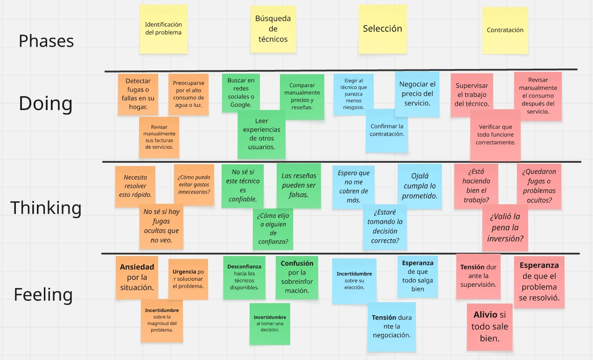
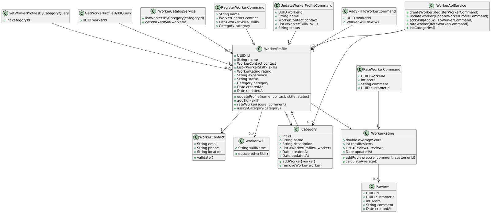
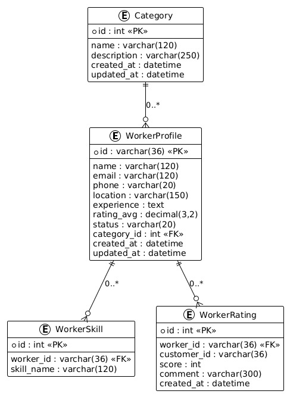

## **Capítulo II: Requirements Elicitation \& Analysis**
  - **2.1. Competidores**

    | Competidor| Descripción| Características| Logo
    |------------------------|--------------------------------------------------------------------------------------------------------------------------------------------------------------|--------------------------------------------------------------------------------------------------------------------------|------|
      | **Ayfix**     | Conecta a técnicos con usuarios para limpieza y reparaciones comunes, usando como canales principales apps móviles y páginas web. | Canal de distribución principal: Aplicaciones de descarga y páginas web |  |
      | **Servicio Técnico de empresas como Sodimac o Maestro** | Ofrecen mantenimiento del hogar, pero con procesos más tradicionales y menor flexibilidad en comparación con plataformas digitales. | Canal de distribución principal: Página web, tienda física y atención telefónica. |  |
      | **Sistemas de domótica (como Google Nest o Xiaomi Home)** | Ofrecen soluciones inteligentes para el hogar, pero con costos elevados y sin conexión directa con técnicos locales. | Canal de distribución principal: Página web y tienda física. |  |

    - **2.1.1. Análisis competitivo**
      
        <table>
            <tr>
            <th colspan="2" align="center">¿Por qué llevar a cabo este análisis?</th>
            <th colspan="5" align="center">Lo realizamos para comprender mejor a la competencia y así ajustar la estrategia de negocio para competir con mayor efectividad.</th>
            </tr>
            <tr>
            <td colspan="2"></td>
            <td align="center">AlguienDijoChamba</td>
            <td align="center">Ayfix</td>
            <td align="center">Sodimac/Maestro</td>
            <td align="center">Nest/Xiaomi Home</td>
            </tr>
            <tr>
            <td rowspan="2" align="center">Perfil</td>
            <td align="center"><b>Overview</b></td>
            <td align="center">Aplicación que conecta a usuarios con técnicos especializados (gasfiteros, carpinteros, etc.) e incorpora un sistema de gamificación (niveles Bronce, Plata y Oro) para fidelizar clientes y motivar a los técnicos.</td>
            <td align="center">Plataforma que enlaza usuarios con técnicos para servicios del hogar, principalmente en limpieza, gasfitería y electricidad básica.</td>
            <td align="center">Servicios técnicos como valor agregado en tiendas físicas y online, vinculados a la compra de productos.</td>
            <td align="center">Sistemas inteligentes para el hogar: temperatura, consumo eléctrico, cámaras, asistentes de voz y más.</td>
            </tr>
            <tr>
            <td align="center"><b>Ventaja competitiva ¿Qué valor ofrece a los clientes?</b></td>
            <td align="center">Interfaz amigable, acceso rápido a técnicos verificados y beneficios por gamificación que generan confianza y fidelidad.</td>
            <td align="center">Amplia red de técnicos de contacto rápido y económico.</td>
            <td align="center">Marca reconocida con cobertura nacional y respaldo en infraestructura.</td>
            <td align="center">Tecnología avanzada e integración con ecosistemas de domótica.</td>
            </tr>
            <tr>
            <td rowspan="2" align="center">Perfil de Marketing</td>
            <td align="center"><b>Mercado objetivo</b></td>
            <td align="center">Hogares y usuarios que requieren servicios de mantenimiento y reparación.</td>
            <td align="center">Usuarios urbanos que requieren soluciones rápidas y económicas para reparaciones básicas.</td>
            <td align="center">Compradores frecuentes de productos para el hogar que necesitan instalación o mantenimiento.</td>
            <td align="center">Consumidores con alto poder adquisitivo interesados en automatización del hogar.</td>
            </tr>
            <tr>
            <td align="center"><b>Estrategias de marketing</b></td>
            <td align="center">Presencia en redes sociales, alianzas con empresas de servicios y campañas digitales.</td>
            <td align="center">Publicidad digital en redes, posicionamiento en tiendas de apps y promociones por servicio.</td>
            <td align="center">Marketing cruzado en tiendas físicas, paquetes con productos y servicios.</td>
            <td align="center">Marketing digital, presencia en retail y alianzas estratégicas con marcas tecnológicas.</td>
            </tr>
            <td rowspan="3" align="center">Perfil de producto</td>
            <td align="center"><b>Productos o servicios</b></td>
            <td align="center">Conexión con técnicos, gestión de solicitudes, pagos inmediatos y sistema de gamificación.</td>
            <td align="center">Servicios de reparaciones básicas, mantenimiento y limpieza.</td>
            <td align="center">Instalación de productos, soporte técnico y servicios adicionales.</td>
            <td align="center">Sensores, cámaras, medidores, asistentes de voz y soluciones de control inteligente.</td>
            </tr>
            <tr>
            <td align="center"><b>Precios y costos</b></td>
            <td align="center">Comisión por servicio y planes de suscripción para técnicos con beneficios adicionales.</td>
            <td align="center">Pago por servicio individual, sin suscripciones.</td>
            <td align="center">Incluido con la compra de productos o con costo adicional.</td>
            <td align="center">Alto costo por dispositivos y su instalación.</td>
            </tr>
            <tr>
            <td align="center"><b>Canales de distribución (web y/o móvil)</b></td>
            <td align="center">Aplicación móvil, página web, redes sociales y convenios con técnicos.</td>
            <td align="center">App móvil y página web.</td>
            <td align="center">Tiendas físicas, página web y call center.</td>
            <td align="center">Página web, e-commerce y tiendas físicas.</td>
            </tr>
            <tr>
            <td rowspan="4" align="center"><b>Análisis SWOT</b></td>
            <td align="center"><b>Fortalezas</b></td>
            <td align="center">Acceso rápido a técnicos verificados, variedad de servicios y motivación mediante gamificación.</td>
            <td align="center">Fácil acceso y rapidez en la contratación de técnicos.</td>
            <td align="center">Marca sólida y de confianza, infraestructura establecida.</td>
            <td align="center">Tecnología avanzada con ecosistema integral de domótica.</td>
            </tr>
            <tr>
            <td align="center"><b>Debilidades</b></td>
            <td align="center">Requiere tiempo para consolidar la red de técnicos y ganar confianza del mercado.</td>
            <td align="center">Limitados a servicios básicos, sin valor agregado.</td>
            <td align="center">Dependencia de terceros para servicios técnicos.</td>
            <td align="center">Costoso, complejo para usuarios comunes, no ofrece mano de obra técnica.</td>
            </tr>
            <tr>
            <td align="center"><b>Oportunidades</b></td>
            <td align="center">Ampliar cobertura a oficinas, edificios y nuevos servicios.</td>
            <td align="center">Escalar hacia servicios especializados.</td>
            <td align="center">Integrar soluciones digitales para mayor agilidad.</td>
            <td align="center">Complementar con técnicos o incluir soporte humano.</td>
            </tr>
            <tr>
            <td align="center"><b>Amenazas</b></td>
            <td align="center">Que grandes competidores copien el modelo y lo escalen más rápido.</td>
            <td align="center">Competencia creciente en apps similares.</td>
            <td align="center">Riesgo de que plataformas digitales más ágiles los desplacen.</td>
            <td align="center">Preferencia de usuarios por alternativas más simples y económicas.</td>
            </tr>
        </table>

    - **2.1.2. Estrategias y tácticas frente a competidores**  
      **Propuesta de valor diferenciada:** Crear una plataforma que conecte de forma rápida y confiable a los usuarios con técnicos especializados (plomeros, electricistas, carpinteros, entre otros), destacándose por la facilidad de uso y tiempos de respuesta cortos.

      **Estrategia digital multicanal:** Posicionarse con campañas en redes sociales, influencers del hogar y tecnología, además de publicidad segmentada en zonas urbanas con alta demanda de servicios básicos.

      **Generación de confianza:** Incorporar testimonios y casos de éxito reales en la aplicación y en campañas publicitarias para transmitir credibilidad y mostrar resultados tangibles.

      **Beneficios iniciales:** Ofrecer promociones y descuentos de lanzamiento, junto con un sistema de gamificación (niveles Bronce, Plata, Oro) que brinde beneficios como descuentos, soporte prioritario y técnicos preferenciales.

      **Valor para técnicos:** Implementar pagos instantáneos al finalizar el servicio, eliminando esperas y motivando a los profesionales a preferir la plataforma.
  - **2.2. Entrevistas**
    - **2.2.1. Diseño de entrevistas**
      
        Con el propósito de identificar de manera más clara las necesidades, comportamientos y expectativas de nuestros usuarios potenciales, hemos elaborado un conjunto de entrevistas. Estas están enfocadas en evaluar la aceptación y el interés por los servicios que plantea AlguienDijoChamba, tanto desde la perspectiva de los hogares que requieren asistencia como desde la de los técnicos que ofrecen su trabajo.

        **Preguntas para el segmento Objetivo 1: Profesionales Tecnicos**

        1. ¿A qué oficio te dedicas actualmente? (fontanero, electricista, carpintero, etc.)
        2. ¿Cómo consigues hoy a tus clientes? (recomendaciones, redes sociales, volanteo, etc.)
        3. ¿Qué dificultades tienes al buscar nuevos clientes o mantener un flujo constante de trabajo?
        4. ¿Has usado antes una aplicación o plataforma digital para ofrecer tus servicios? ¿Qué tal fue tu experiencia?
        5. Si existiera una app como AlguienDijoChamba, ¿qué herramientas te gustaría que incluya para facilitar tu trabajo? (agenda, cotizaciones, chat, pagos, etc.)
        6. ¿Qué tan importante sería para ti contar con un perfil verificado y calificaciones que destaquen tu experiencia?
        7. ¿Qué opinas de un sistema de gamificación con niveles (Bronce, Plata, Oro) que te dé beneficios como mayor visibilidad, prioridad en solicitudes o menos comisión? ¿Lo considerarías motivador?
        8. ¿Qué beneficios te gustaría recibir al subir de nivel en este sistema?
        9. ¿Qué tan atractivo te resulta que la app te pague de forma instantánea al terminar el servicio, sin esperar días o trámites adicionales?
        10. ¿Qué esperas de una plataforma como esta en términos de pagos, seguridad, comunicación con clientes y flexibilidad?
        11. ¿Qué valorarías más en una plataforma como AlguienDijoChamba? (visibilidad, facilidad de pago, agenda organizada, historial de clientes, etc.)

        **Preguntas para el segmento Objetivo 2: Clientes**
      1. En tu casa, ¿cada cuánto tiempo sueles necesitar servicios de técnicos como fontaneros, electricistas o carpinteros?
      2. Cuando surge un problema en tu hogar, ¿cómo sueles encontrar a un técnico? (ejemplo: recomendaciones, redes sociales, directorios, etc.)
      3. ¿Qué dificultades has tenido al buscar un técnico confiable para tu casa?
      4. ¿Qué tan importante es para ti conocer las referencias, calificaciones o experiencia de un técnico antes de contratarlo?
      5. ¿Alguna vez has usado una aplicación o página web para contratar un técnico? ¿Cómo fue tu experiencia?
      6. Si existiera una app que verificara la identidad y experiencia de los técnicos, ¿te daría más confianza contratar por ahí?
      7. Si una app ofreciera un sistema de niveles (Bronce, Plata, Oro) que te otorgue beneficios como descuentos, acceso a técnicos preferenciales o soporte prioritario, ¿qué tan atractivo te parecería?
      8. ¿Qué beneficios esperarías recibir para motivarte a subir de nivel en un sistema de gamificación como este?
      9. ¿Qué opinas de que los técnicos reciban el pago inmediatamente al finalizar el servicio? ¿Crees que eso aumentaría tu confianza como usuario?
      Pensando en una app como AlguienDijoChamba, ¿qué funciones te serían más útiles? (ejemplo: chat con técnicos, historial de servicios, alertas, cotización inmediata, pagos digitales, etc.)
      10. Pensando en una app como AlguienDijoChamba, ¿qué funciones te serían más útiles? (ejemplo: chat con técnicos, historial de servicios, alertas, cotización inmediata, pagos digitales, etc.)

  - **2.2.2. Registro de entrevistas**

    **Entrevistas Segmento Objetivo 1: Profesionales Tecnicos**

      **Entrevista 1:**
      Datos del entrevistador:
      - Nombre: ---
        
      Datos del entrevistado:
      - Nombre: ---
      - Edad: --
      - Distrito de residencia: --
      - Enlace: ---
        
      colocar imagen

      **Resumen de la entrevista:**

      **Entrevista 2:**
      Datos del entrevistador:
      - Nombre: ---
        
      Datos del entrevistado:
      - Nombre: --
      - Edad: ---
      - Distrito de residencia: ---
      - Enlace: ---
        
      Colocar imageen

      **Resumen de la entrevista:**

      **Entrevista 3:**
      Datos del entrevistador:
      - Nombre: --
        
      Datos del entrevistado:
      - Nombre: --
      - Edad: --
      - Distrito de residencia: --
      - Enlace: https:--

      colocar imagen

      **Resumen de la entrevista:**

      **Entrevistas Segmento Objetivo 2: Clientes**

     **Entrevista 1:**
      Datos del entrevistador:
      - Nombre: Percy Alonso Muñiz 
        
      Datos del entrevistado:
      - Nombre: Jarol Saquiray
      - Edad: 20 años
      - Distrito de residencia: San Miguel
      - Enlace: https: https://upcedupe-my.sharepoint.com/:v:/g/personal/u202319563_upc_edu_pe/EZFZqWNG6YxBkSdNJ7LHjeYBfHsrCofeJ4sZXGpIg7DKsg?nav=eyJyZWZlcnJhbEluZm8iOnsicmVmZXJyYWxBcHAiOiJPbmVEcml2ZUZvckJ1c2luZXNzIiwicmVmZXJyYWxBcHBQbGF0Zm9ybSI6IldlYiIsInJlZmVycmFsTW9kZSI6InZpZXciLCJyZWZlcnJhbFZpZXciOiJNeUZpbGVzTGlua0NvcHkifX0&e=CUDdgk
        
      

      **Resumen de la entrevista:**

      Jarol percibe una aplicación como AlguienDijoChamba como una alternativa confiable frente a redes sociales. Le atrae la idea de técnicos verificados, pagos transparentes y beneficios a través de niveles. Considera que la principal propuesta de valor debe ser la confianza y la rapidez en la atención.

      **Entrevista 2:**
      Datos del entrevistador:
      - Nombre: Percy Alonso Muñiz Huayanca
        
      Datos del entrevistado:
      - Nombre: Leonardo Caballa
      - Edad: 20 años
      - Distrito de residencia: Jesus Maria
      - Enlace:
        
      Agregar Imagen

      **Resumen de la entrevista:**

      Leonardo identifica como problemas principales la informalidad y la falta de confianza al contratar técnicos por canales tradicionales. Percibe en AlguienDijoChamba una solución viable gracias a la verificación de perfiles, la transparencia en costos y la facilidad de comunicación. Además, muestra interés en la gamificación y en sistemas de pago digital inmediato, lo cual refuerza la importancia de ofrecer seguridad, beneficios tangibles y una experiencia ágil para los usuarios.

      **Entrevista 3:**
      Datos del entrevistador:
      - Nombre: Percy Alonso Muñiz 
        
      Datos del entrevistado:
      - Nombre: Angel Garcia
      - Edad: 21 años
      - Distrito de residencia: Surco
      - Enlace: 
        
      Agregar Imagen

      **Resumen de la entrevista:**

      Ángel ve a AlguienDijoChamba como una oportunidad para resolver problemas de informalidad, costos inesperados y falta de garantías en los servicios técnicos. Considera que la verificación de técnicos, la transparencia en precios y los pagos digitales inmediatos son elementos esenciales. Además, valora la incorporación de un sistema de niveles con beneficios y la posibilidad de integrar monitoreo inteligente en el hogar, lo cual refuerza el atractivo de la plataforma.

   - **2.2.3. Análisis de entrevistas**

      **Análisis Segmento Objetivo 1: Profesionales Tecnicos**

      Agregar Imaagen

      **Analisis Segmento Objetivo 2: Clientes**

      Las entrevistas evidencian una necesidad común de confianza, transparencia y seguridad al contratar técnicos. La propuesta de AlguienDijoChamba resulta atractiva al combinar verificación de perfiles, referencias confiables, cotizaciones claras y pagos digitales inmediatos. Además, la incorporación de gamificación y monitoreo inteligente refuerza la diferenciación de la plataforma, respondiendo tanto a las expectativas prácticas (costos, rapidez, calidad) como a la generación de valor agregado en el hogar

      Agregar Imagen

      Conclusión
      En general, las entrevistas confirmaron que AlguienDijoChamba responde a necesidades reales. Los clientes buscan seguridad, transparencia y facilidad. Los técnicos necesitan herramientas para crecer profesionalmente y llegar a más personas. Ambos segmentos mostraron interés en la propuesta y en las funcionalidades planteadas, lo cual refuerza el valor de la plataforma que estamos construyendo.

  - **2.3. Needfinding**
    - **2.3.1. User Personas**

        **Segmento Objetivo 1: Profesionales Tecnicos**

        

        **Segmento Objetivo 2: Clientes**
        
        
    - **2.3.2. User Task Matrix** 

       A continuación, se presenta una matriz de tareas enfocada en los segmentos principales de la plataforma **AlguienDijoChamba** 
      
        Esta herramienta permite identificar y clasificar las actividades clave que realiza cada segmento, considerando la frecuencia con la que las llevan a cabo y el nivel de importancia que representan dentro de su interacción con la plataforma.

      | Tarea | Profesionales Técnicos (Frecuencia / Importancia) | Clientes (Frecuencia / Importancia) |
      |-------|---------------------------------------------------|-------------------------------------|
      | Registrarse en la plataforma | Baja / Alta | Baja / Media |
      | Completar perfil y certificaciones | Baja / Alta | - |
      | Recibir notificaciones de servicios | Frecuente / Alta | - |
      | Aceptar o rechazar solicitudes | Frecuente / Alta | - |
      | Buscar técnicos según ubicación y oficio | - | Frecuente / Alta |
      | Revisar perfiles y calificaciones | - | Frecuente / Alta |
      | Agendar y confirmar servicio | - | Frecuente / Alta |
      | Calificar al técnico | - | Frecuente / Alta |
      | Participar en gamificación (niveles, puntos, recompensas) | Frecuente / Media | Frecuente / Media |

      Del análisis de esta matriz, se observa que:  
      - Para los **técnicos**, las actividades más críticas son **recibir notificaciones** y **aceptar/rechazar solicitudes**, ya que determinan la generación de ingresos y la continuidad de su trabajo.  
      - Para los **clientes**, las tareas más frecuentes y de mayor importancia están relacionadas con la **búsqueda, revisión de perfiles, agenda y calificación de técnicos**, lo que       refleja la necesidad de confianza y eficiencia en el proceso de contratación.  
      - En ambos segmentos, la **gamificación** aparece como una oportunidad para mantener el compromiso, incentivar la participación y generar un ecosistema más dinámico.  
      - Finalmente, tareas iniciales como el **registro** o completar el perfil, aunque se realizan una sola vez, tienen un peso alto en la experiencia inicial del usuario, por lo que deben diseñarse de forma simple e intuitiva.  

    - **2.3.3. User Journey Mapping**
    
    - **2.3.4. Empathy Mapping**

         **Segmento Objetivo 1: Profesionales Tecnicos**
        
        #### Fernando Silva
        ---    
          
        

        **Segmento Objetivo 2: Clientes**

        #### Christian Martinez
        --- 
        
        
    - **2.3.5. As-is Scenario Mapping**
        
        **Segmento Objetivo 1: Profesionales Tecnicos**

        

        **Segmento Objetivo 2: Clientes**
        
        
  - **2.4. Ubiquitous Language** 

    | Término en Inglés (Español) | Definición |
    |-----------------------------|------------|
    | **Account (Cuenta)** | Identidad digital de un usuario dentro de la plataforma. Incluye credenciales de acceso y estado de la cuenta. |
    | **User (Usuario)** | Entidad básica que representa a una persona registrada en la plataforma. Contiene información personal esencial. |
    | **Customer (Cliente)** | Usuario que solicita servicios técnicos o profesionales a través de la plataforma. |
    | **Worker (Trabajador Técnico)** | Profesional que ofrece servicios en la plataforma. Posee experiencia validada, habilidades técnicas y certificaciones. |
    | **Experience (Experiencia)** | Historial laboral de un trabajador técnico que respalda su trayectoria en distintos roles o empresas. |
    | **Review (Reseña)** | Calificación y comentario que un usuario emite sobre un servicio recibido o prestado. |
    | **Proposal (Propuesta)** | Oferta formal presentada por un trabajador técnico a un cliente. Contiene la descripción del trabajo, precio y tiempo estimado. |
    | **Sales Order Payment (Orden de Pago)** | Registro financiero de la transacción entre cliente y trabajador por los servicios acordados. |
    | **Hourly Rate (Tarifa por Hora)** | Monto que un trabajador técnico define como su costo por hora de servicio. |
    | **Field (Campo de Especialidad)** | Área técnica específica en la que un trabajador se desempeña profesionalmente. |
    | **Skills (Habilidades)** | Conjunto de competencias técnicas y conocimientos que posee un trabajador. |
    | **Gamification (Gamificación)** | Sistema de incentivos basado en puntos, niveles (Bronce, Plata, Oro) y recompensas, diseñado para motivar la participación activa y la fidelización de clientes y técnicos. |
    | **Level (Nivel)** | Categoría alcanzada dentro del sistema de gamificación (ej. Bronce, Plata, Oro) que refleja la participación, reputación y logros de un usuario en la plataforma. |
    | **Reward (Recompensa)** | Beneficio tangible o intangible otorgado a clientes o técnicos como resultado de su participación y logros en la plataforma. |

    - **2.4.1. User Stories**
      ### Epic Story
      | Epic ID | Título |
      |--------|--------|
      | **EP01** | **Registro y Gestión de Perfil de Usuario** |
      | | Como usuario (cliente o técnico) de Alguien Dijo Chamba, quiero crear, visualizar, editar y gestionar mi perfil para tener mis datos actualizados y poder utilizar la plataforma correctamente. |

      | Epic ID | Título |
      |--------|--------|
      | **EP02** | **Búsqueda y Contacto de Profesionales** |
      | | Como cliente, quiero buscar profesionales por especialidad, ubicación y reputación, y contactarlos fácilmente para solicitar sus servicios. |

      | Epic ID | Título |
      |--------|--------|
      | **EP03** | **Gestión de Servicios Técnicos (para Profesionales)** |
      | | Como profesional técnico, quiero gestionar mi perfil de servicios, disponibilidad y recibir solicitudes de trabajo a través de la app, asegurando que los pagos sean instantáneos al terminar el servicio. |

      | Epic ID | Título |
      |--------|--------|
      | **EP04** | **Gamificación y Beneficios** |
      | | Como usuario, quiero subir de nivel (Bronce, Plata, Oro) según mi actividad en la plataforma para desbloquear beneficios como descuentos, técnicos preferenciales y soporte prioritario. |

      | Epic ID | Título |
      |--------|--------|
      | **EP05** | **Gestión de Solicitudes y Contrataciones** |
      | | Como cliente, quiero gestionar mis solicitudes de servicio, ver el estado de las contrataciones y realizar pagos de forma segura a través de la app. Como profesional, quiero gestionar las solicitudes recibidas y confirmar los trabajos con pagos instantáneos. |

      | Epic ID | Título |
      |--------|--------|
      | **EP06** | **Sistema de Calificaciones y Reseñas** |
      | | Como cliente, quiero calificar y dejar reseñas sobre los servicios o profesionales, y ver las calificaciones y reseñas de otros para tomar decisiones informadas. |
    
      ### User Stories

      | Story ID | User    | Priority | Epic  |
      |----------|---------|----------|-------|
      | US01     | Cliente | Alta     | EP01  |

      ---

      | Title   | Registro de Nuevo Usuario |
      |---------|--------------------------|
      | ****Description**** | Como nuevo cliente, quiero registrarme en la plataforma para poder buscar y contratar profesionales. |

      | Acceptance Criteria |
      |---------------------|
      | **Escenario 1:** Dado que soy un usuario nuevo, cuando ingreso correo válido y contraseña segura, entonces mi cuenta se crea exitosamente. |
      | **Escenario 2:** Dado que ingreso datos inválidos, cuando intento registrarme, entonces la app muestra un mensaje de error indicando qué debo corregir. |
      | **Escenario 3:** Dado que ya tengo una cuenta, cuando intento registrarme con el mismo correo, entonces la app indica que el correo ya está en uso. |

      **---**

      | Story ID | User                | Priority | Epic  |
      |----------|---------------------|----------|-------|
      | US02     | Profesional Técnico | Alta     | EP01  |

      ---

      | Title   | Registro de Nuevo Profesional |
      |---------|------------------------------|
      | **Description** | Como nuevo profesional técnico, quiero registrarme detallando mis especialidades, experiencia y contacto para ofrecer mis servicios. 

      | Acceptance Criteria |
      |---------------------|
      | **Escenario 1:** Dado que completo todos los campos requeridos, cuando envío la información, entonces mi perfil se crea correctamente. |
      | **Escenario 2:** Dado que omito campos obligatorios, cuando intento registrar el perfil, entonces la app indica qué información falta. |
      | **Escenario 3:** Dado que ingreso datos incorrectos, cuando envío el registro, entonces la app muestra error indicando el formato correcto. |

      **---**

      | Story ID | User    | Priority | Epic  |
      |----------|---------|----------|-------|
      | US03     | Usuario | Media    | EP01  |

      ---

      | Title   | Recuperación de Cuenta/Login |
      |---------|-----------------------------|
      | **Description** | Como usuario, quiero recuperar mi cuenta o iniciar sesión mediante diferentes métodos. |

      | Acceptance Criteria |
      |---------------------|
      | **Escenario 1:** Dado que olvidé mi contraseña, cuando solicito restablecerla, entonces recibo un correo con enlace para crear nueva contraseña. |
      | **Escenario 2:** Dado que quiero acceder rápidamente, cuando uso inicio de sesión con Google, entonces me autentico sin necesidad de recordar contraseña. |
      | **Escenario 3:** Dado que ingreso credenciales incorrectas, cuando intento iniciar sesión, entonces la app muestra mensaje de error específico. |

      **---**

      | Story ID | User              | Priority | Epic  |
      |----------|-------------------|----------|-------|
      | US04     | Usuario Registrado| Media    | EP01  |

      ---

      | Title   | Editar Perfil de Usuario |
      |---------|-------------------------|
      | **Description** | Como usuario registrado, quiero poder editar la información de mi perfil para mantenerla actualizada. |

      | Acceptance Criteria |
      |---------------------|
      | **Escenario 1:** Dado que quiero actualizar mis datos, cuando modifico y guardo la información, entonces la app actualiza correctamente mi perfil. |
      | **Escenario 2:** Dado que ingreso un número con formato incorrecto, cuando intento guardar, entonces la app muestra un mensaje de error. |

      **---**

      | Story ID | User    | Priority | Epic  |
      |----------|---------|----------|-------|
      | US05     | Cliente | Alta     | EP02  |

      ---

      | Title   | Ver Perfil Detallado del Profesional |
      |---------|--------------------------------------|
      | **Description** | Como cliente, quiero ver el perfil completo de un profesional con toda su información relevante. |

      | Acceptance Criteria |
      |---------------------|
      | **Escenario 1:** Dado que quiero evaluar un profesional, cuando ingreso a su perfil, entonces puedo ver experiencia, especialidades, calificaciones, tarifas y disponibilidad. |
      | **Escenario 2:** Dado que hay varios profesionales, cuando comparo perfiles, entonces puedo ver diferencias en tarifas, calificaciones y disponibilidad. |
      | **Escenario 3:** Dado que necesito información específica, cuando visualizo el perfil, entonces puedo ver reseñas detalladas de otros clientes. |

      **---**

      | Story ID | User    | Priority | Epic  |
      |----------|---------|----------|-------|
      | US06     | Cliente | Media    | EP02  |

      ---

      | Title   | Contactar al Profesional |
      |---------|-------------------------|
      | **Description** | Como cliente, quiero contactar directamente a un profesional para coordinar un servicio. |

      | Acceptance Criteria |
      |---------------------|
      | **Escenario 1:** Dado que quiero enviar un mensaje, cuando uso el perfil del profesional, entonces puedo enviarle un mensaje directo. |
      | **Escenario 2:** Dado que quiero solicitar cotización, cuando la pido desde su perfil, entonces el profesional recibe mi solicitud con todos los detalles. |

      **---**

      | Story ID | User    | Priority | Epic  |
      |----------|---------|----------|-------|
      | US07     | Cliente | Alta     | EP02  |

      ---

      | Title   | Buscar Profesionales por Especialidad y Ubicación |
      |---------|--------------------------------------------------|
      | **Description** | Como cliente, quiero buscar profesionales filtrando por tipo de servicio y ubicación. |

      | Acceptance Criteria |
      |---------------------|
      | **Escenario 1:** Dado que busco un profesional, cuando aplico filtros de especialidad y ubicación, entonces la app muestra profesionales disponibles. |
      | **Escenario 2:** Dado que no hay profesionales en mi zona, cuando realizo la búsqueda, entonces la app muestra un mensaje "no se encontraron resultados". |
      | **Escenario 3:** Dado que quiero eficiencia, cuando uso filtros múltiples, entonces la app muestra resultados ordenados por reputación o cercanía. |

      **---**

      | Story ID | User    | Priority | Epic  |
      |----------|---------|----------|-------|
      | US08     | Cliente | Alta     | EP02  |

      ---

      | Title   | Solicitar Servicio al Profesional |
      |---------|-----------------------------------|
      | **Description** | Como cliente, quiero contactar a un profesional y solicitar un servicio. |

      | Acceptance Criteria |
      |---------------------|
      | **Escenario 1:** Dado que quiero un servicio, cuando envío la solicitud desde el perfil del profesional, entonces puedo elegir fecha y hora y el profesional recibe la solicitud. |
      | **Escenario 2:** Dado que hay conflictos de horario, cuando selecciono fecha y hora, entonces la app alerta si hay disponibilidad del profesional. |
      | **Escenario 3:** Dado que necesito agregar detalles, cuando adjunto fotos o descripción adicional, entonces el profesional recibe toda la información completa. |

      **---**

      | Story ID | User                | Priority | Epic  |
      |----------|---------------------|----------|-------|
      | US09     | Profesional Técnico | Alta     | EP03  |

      ---

      | Title   | Crear y Actualizar Servicios Ofrecidos |
      |---------|----------------------------------------|
      | **Description** | Como técnico, quiero gestionar mi lista de servicios ofrecidos. |

      | Acceptance Criteria |
      |---------------------|
      | **Escenario 1:** Dado que quiero añadir o modificar un servicio, cuando actualizo mi perfil, entonces la lista de servicios se refleja para los clientes. |
      | **Escenario 2:** Dado que quiero cambiar mis tarifas, cuando actualizo los precios, entonces los clientes ven las nuevas tarifas inmediatamente. |

      **---**

      | Story ID | User                | Priority | Epic  |
      |----------|---------------------|----------|-------|
      | US10     | Profesional Técnico | Alta     | EP03  |

      ---

      | Title   | Gestionar Disponibilidad |
      |---------|-------------------------|
      | **Description** | Como técnico, quiero gestionar mi disponibilidad para solicitudes. |

      | Acceptance Criteria |
      |---------------------|
      | **Escenario 1:** Dado que quiero definir horarios, cuando actualizo disponibilidad, entonces la app muestra mis horas disponibles en tiempo real. |
      | **Escenario 2:** Dado que tengo un imprevisto, cuando modifico mi disponibilidad, entonces las solicitudes futuras se ajustan automáticamente. |

      **---**

      | Story ID | User                | Priority | Epic  |
      |----------|---------------------|----------|-------|
      | US11     | Profesional Técnico | Alta     | EP03  |

      ---

      | Title   | Recibir Notificaciones de Solicitudes |
      |---------|--------------------------------------|
      | **Description** | Como técnico, quiero recibir notificaciones instantáneas sobre nuevas solicitudes. |

      | Acceptance Criteria |
      |---------------------|
      | **Escenario 1:** Dado que hay una nueva solicitud, cuando el cliente la envía, entonces recibo notificación con detalles de servicio y ubicación. |
      | **Escenario 2:** Dado que estoy fuera de línea, cuando la app sincroniza al conectarme, entonces recibo todas las notificaciones pendientes. |
      | **Escenario 3:** Dado que hay múltiples solicitudes, cuando llegan, entonces puedo ordenarlas por prioridad o cercanía. |

      **---**

      | Story ID | User                | Priority | Epic  |
      |----------|---------------------|----------|-------|
      | US12     | Profesional Técnico | Alta     | EP03  |

      ---

      | Title   | Aceptar o Rechazar Solicitudes |
      |---------|-------------------------------|
      | **Description** | Como técnico, quiero aceptar o rechazar solicitudes de trabajo. |

      | Acceptance Criteria |
      |---------------------|
      | **Escenario 1:** Dado que recibo una solicitud, cuando acepto o rechazo, entonces el cliente es notificado sobre mi decisión. |
      | **Escenario 2:** Dado que rechazo una solicitud, cuando proporciono una razón, entonces el cliente recibe feedback constructivo. |

      **---**

      | Story ID | User                | Priority | Epic  |
      |----------|---------------------|----------|-------|
      | US13     | Profesional Técnico | Alta     | EP03  |

      ---

      | Title   | Confirmar Finalización de Servicio |
      |---------|------------------------------------|
      | **Description** | Como técnico, quiero marcar un servicio como completado y registrar trabajo final, y recibir el pago instantáneo. |

      | Acceptance Criteria |
      |---------------------|
      | **Escenario 1:** Dado que finalizo un servicio, cuando lo marco como completado, entonces la app permite subir descripción final y fotos del trabajo. |
      | **Escenario 2:** Dado que el servicio está completado, cuando lo confirmo, entonces recibo mi pago instantáneamente sin demoras. |

      **---**

      | Story ID | User    | Priority | Epic  |
      |----------|---------|----------|-------|
      | US14     | Cliente | Media    | EP05  |

      ---

      | Title   | Notificación de Respuesta del Profesional |
      |---------|-------------------------------------------|
      | **Description** | Como cliente, quiero recibir notificaciones cuando un profesional acepta o rechaza mi solicitud. |

      | Acceptance Criteria |
      |---------------------|
      | **Escenario 1:** Dado que un profesional acepta mi solicitud, cuando confirma, entonces recibo notificación con los detalles de confirmación. |
      | **Escenario 2:** Dado que un profesional rechaza mi solicitud, cuando lo hace, entonces recibo notificación con la razón del rechazo. |

      **---**

      | Story ID | User    | Priority | Epic  |
      |----------|---------|----------|-------|
      | US15     | Usuario | Media    | EP04  |

      ---

      | Title   | Visualizar Progreso y Puntos Acumulados |
      |---------|-----------------------------------------|
      | **Description** | Como usuario, quiero ver mi progreso y puntos acumulados en el sistema de gamificación. |

      | Acceptance Criteria |
      |---------------------|
      | **Escenario 1:** Dado que completo actividades en la plataforma, cuando reviso mi perfil, entonces puedo ver mis puntos acumulados y progreso hacia el siguiente nivel. |
      | **Escenario 2:** Dado que quiero conocer mis beneficios, cuando accedo a mi dashboard, entonces veo los beneficios actuales y próximos disponibles. |

      **---**

      | Story ID | User    | Priority | Epic  |
      |----------|---------|----------|-------|
      | US16     | Usuario | Media    | EP04  |

      ---

      | Title   | Recibir Recompensas por Logros |
      |---------|-------------------------------|
      | **Description** | Como usuario, quiero recibir recompensas al completar logros específicos en la plataforma. |

      | Acceptance Criteria |
      |---------------------|
      | **Escenario 1:** Dado que completo un logro específico, cuando alcanzo el objetivo, entonces recibo notificación de recompensa y esta se aplica automáticamente. |
      | **Escenario 2:** Dado que subo de nivel, cuando alcanzo nuevo nivel, entonces desbloqueo nuevos beneficios y recompensas exclusivas. |

      **---**

      | Story ID | User    | Priority | Epic  |
      |----------|---------|----------|-------|
      | US17     | Cliente | Alta     | EP05  |

      ---

      | Title   | Crear Solicitud de Servicio |
      |---------|----------------------------|
      | **Description** | Como cliente, quiero crear solicitud de servicio detallada. |

      | Acceptance Criteria |
      |---------------------|
      | **Escenario 1:** Dado que necesito un servicio, cuando creo la solicitud, entonces puedo agregar descripción, imágenes y fecha de servicio. |
      | **Escenario 2:** Dado que el profesional tiene tarifas variables, cuando creo la solicitud, entonces puedo ver un estimado de costo antes de enviarla. |
      | **Escenario 3:** Dado que quiero confirmar detalles, cuando envío la solicitud, entonces recibo un resumen y confirmación de registro. |

      **---**

      | Story ID | User    | Priority | Epic  |
      |----------|---------|----------|-------|
      | US18     | Cliente | Media    | EP05  |

      ---

      | Title   | Ver Estado de la Solicitud |
      |---------|---------------------------|
      | **Description** | Como cliente, quiero ver el estado de mis solicitudes en tiempo real. |

      | Acceptance Criteria |
      |---------------------|
      | **Escenario 1:** Dado que tengo solicitudes, cuando ingreso a mis solicitudes, entonces puedo ver estado (pendiente, en progreso, completada) actualizado. |
      | **Escenario 2:** Dado que el estado cambia, cuando ocurre una actualización, entonces recibo notificación del cambio de estado. |

      **---**

      | Story ID | User    | Priority | Epic  |
      |----------|---------|----------|-------|
      | US19     | Cliente | Alta     | EP05  |

      ---

      | Title   | Realizar Pago del Servicio |
      |---------|---------------------------|
      | **Description** | Como cliente, quiero pagar los servicios de forma segura. |

      | Acceptance Criteria |
      |---------------------|
      | **Escenario 1:** Dado que debo pagar, cuando uso tarjeta o transferencia, entonces la app confirma pago exitoso y entrega recibo. |
      | **Escenario 2:** Dado que el pago falla, cuando intento pagar, entonces la app notifica el error y sugiere solución. |
      | **Escenario 3:** Dado que quiero seguridad, cuando pago, entonces la transacción se registra y queda disponible en historial de pagos. |

      **---**

      | Story ID | User    | Priority | Epic  |
      |----------|---------|----------|-------|
      | US20     | Cliente | Media    | EP05  |

      ---

      | Title   | Solicitar Reembolso o Disputa |
      |---------|------------------------------|
      | **Description** | Como cliente, quiero solicitar reembolso o iniciar disputa en caso de servicio no satisfactorio. |

      | Acceptance Criteria |
      |---------------------|
      | **Escenario 1:** Dado que el servicio no fue satisfactorio, cuando solicito reembolso, entonces la plataforma inicia proceso de revisión. |
      | **Escenario 2:** Dado que tengo una disputa, cuando presento evidencia, entonces el equipo de soporte revisa mi caso en un plazo definido. |

      **---**

      | Story ID | User                | Priority | Epic  |
      |----------|---------------------|----------|-------|
      | US21     | Profesional Técnico | Alta     | EP05  |

      ---

      | Title   | Confirmación de Contratación por Profesional |
      |---------|---------------------------------------------|
      | **Description** | Como técnico, quiero aceptar o rechazar solicitudes, y recibir pagos instantáneos. |

      | Acceptance Criteria |
      |---------------------|
      | **Escenario 1:** Dado que recibo solicitud, cuando acepto o rechazo, entonces la app notifica al cliente automáticamente. |
      | **Escenario 2:** Dado que finalizo el trabajo, cuando confirmo la finalización, entonces el pago se libera inmediatamente. |

      **---**

      | Story ID | User    | Priority | Epic  |
      |----------|---------|----------|-------|
      | US22     | Cliente | Media    | EP05  |

      ---

      | Title   | Cancelar Solicitud de Servicio |
      |---------|-------------------------------|
      | **Description** | Como cliente, quiero cancelar una solicitud si no la necesito. |

      | Acceptance Criteria |
      |---------------------|
      | **Escenario 1:** Dado que deseo cancelar, cuando lo hago desde la app, entonces la solicitud se elimina y el profesional es notificado. |
      | **Escenario 2:** Dado que cancelo a tiempo, cuando cumplo con políticas de cancelación, entonces recibo reembolso completo. |

      **---**

      | Story ID | User                | Priority | Epic  |
      |----------|---------------------|----------|-------|
      | US23     | Profesional Técnico | Media    | EP05  |

      ---

      | Title   | Notificación de Nueva Solicitud de Servicio |
      |---------|---------------------------------------------|
      | **Description** | Como técnico, quiero recibir notificaciones de nuevas solicitudes. |

      | Acceptance Criteria |
      |---------------------|
      | **Escenario 1:** Dado que hay una nueva solicitud, cuando el cliente la crea, entonces recibo notificación inmediata con detalles. |
      | **Escenario 2:** Dado que la solicitud es urgente, cuando el cliente marca prioridad alta, entonces recibo alerta especial. |

      **---**

      | Story ID | User    | Priority | Epic  |
      |----------|---------|----------|-------|
      | US24     | Cliente | Alta     | EP06  |

      ---

      | Title   | Abrir Reclamo/Ticket |
      |---------|----------------------|
      | **Description** | Como cliente, quiero abrir un reclamo si el servicio no fue satisfactorio, para que la plataforma lo gestione. |

      | Acceptance Criteria |
      |---------------------|
      | **Escenario 1:** Dado que el servicio no cumplió expectativas, cuando abro un reclamo, entonces especifico detalles y adjunto evidencias. |
      | **Escenario 2:** Dado que presento un reclamo, cuando lo envío, entonces recibo número de ticket y tiempo estimado de respuesta. |

      **---**

      | Story ID | User    | Priority | Epic  |
      |----------|---------|----------|-------|
      | US25     | Cliente | Media    | EP06  |

      ---

      | Title   | Calificar a un Profesional |
      |---------|---------------------------|
      | **Description** | Como cliente, quiero calificar a un profesional tras el servicio. |

      | Acceptance Criteria |
      |---------------------|
      | **Escenario 1:** Dado que recibí un servicio, cuando doy una calificación de 1-5 estrellas y un comentario, entonces queda registrado en su perfil. |
      | **Escenario 2:** Dado que quiero ser objetivo, cuando califico, entonces puedo evaluar diferentes aspectos como puntualidad, calidad y profesionalismo. |

      **---**

      | Story ID | User    | Priority | Epic  |
      |----------|---------|----------|-------|
      | US26     | Cliente | Media    | EP06  |

      ---

      | Title   | Ver Calificaciones de Profesionales |
      |---------|------------------------------------|
      | **Description** | Como cliente, quiero ver calificaciones y reseñas de otros usuarios. |

      | Acceptance Criteria |
      |---------------------|
      | **Escenario 1:** Dado que quiero evaluar, cuando ingreso al perfil del profesional, entonces veo calificaciones y comentarios de otros clientes. |
      | **Escenario 2:** Dado que quiero información veraz, cuando leo reseñas, entonces puedo filtrar por calificación y fecha. |

      **---**

      | Story ID | User    | Priority | Epic  |
      |----------|---------|----------|-------|
      | US27     | Cliente | Media    | EP06  |

      ---

      | Title   | Calificación Promedio del Profesional |
      |---------|--------------------------------------|
      | **Description** | Como cliente, quiero ver la calificación promedio del profesional. |

      | Acceptance Criteria |
      |---------------------|
      | **Escenario 1:** Dado que quiero referencia rápida, cuando ingreso al perfil, entonces la app muestra la calificación promedio actualizada. |
      | **Escenario 2:** Dado que comparo profesionales, cuando reviso sus perfiles, entonces veo calificación promedio destacada visiblemente. |

      **---**

      | Story ID | User    | Priority | Epic  |
      |----------|---------|----------|-------|
      | US28     | Cliente | Baja     | EP06  |

      ---

      | Title   | Reseñas Anónimas |
      |---------|------------------|
      | **Description** | Como cliente, quiero dejar reseñas de forma anónima. |

      | Acceptance Criteria |
      |---------------------|
      | **Escenario 1:** Dado que deseo privacidad, cuando publico una reseña, entonces la app oculta mi identidad al resto de usuarios. |
      | **Escenario 2:** Dado que elijo anonimato, cuando dejo reseña, entonces mi perfil no aparece vinculado a la evaluación. |

      **---**

      | Story ID | User    | Priority | Epic  |
      |----------|---------|----------|-------|
      | US29     | Cliente | Media    | EP06  |

      ---

      | Title   | Ver Reseñas de Otros Clientes |
      |---------|------------------------------|
      | **Description** | Como cliente, quiero ver reseñas de otros usuarios. |

      | Acceptance Criteria |
      |---------------------|
      | **Escenario 1:** Dado que quiero referencias, cuando ingreso al perfil del profesional, entonces puedo ver reseñas recientes y detalladas de otros clientes. |
      | **Escenario 2:** Dado que busco información específica, cuando filtro reseñas, entonces encuentro evaluaciones sobre aspectos particulares del servicio. |

      **---**

      | Story ID | User    | Priority | Epic  |
      |----------|---------|----------|-------|
      | US30     | Cliente | Baja     | EP06  |

      ---

      | Title   | Solicitar Actualización de Calificación |
      |---------|----------------------------------------|
      | **Description** | Como cliente, quiero actualizar mi calificación si cambio de opinión. |

      | Acceptance Criteria |
      |---------------------|
      | **Escenario 1:** Dado que quiero modificar mi reseña, cuando la edito, entonces la app actualiza la calificación y el comentario. |
      | **Escenario 2:** Dado que me equivoqué, cuando corrijo mi evaluación, entonces el profesional recibe la calificación actualizada. |
       |
      
      ### Technical Stories 

      | **Story ID** | **User**               | **Priority** | **Epic** | **Title**                                       | ****Description****                                                                                                                                                        | **Acceptance Criteria**                                                                                                                                                                                                          |
      | ------------ | ---------------------- | ------------ | -------- | ----------------------------------------------- | ---------------------------------------------------------------------------------------------------------------------------------------------------------------------- | -------------------------------------------------------------------------------------------------------------------------------------------------------------------------------------------------------------------------------- |
      | TS01         | Desarrollador Backend  | Alta         | EP01     | Visualizar Lista de Profesionales               | Como desarrollador backend, quiero crear una API que permita al usuario visualizar una lista de profesionales disponibles según la especialidad y ubicación.           | 1. La API debe permitir filtrar los profesionales por especialidad y ubicación.   2. La respuesta debe incluir información mínima como nombre, especialidad, y calificación.                                                  |
      | TS02         | Desarrollador Backend  | Alta         | EP01     | Registrar Nuevo Profesional                     | Como desarrollador backend, quiero implementar un servicio que permita registrar un nuevo profesional con todos sus datos relevantes.                                  | 1. Los datos deben ser validados y guardados en la base de datos.   2. El profesional debe recibir confirmación de registro exitoso.   3. La interfaz debe mostrar mensajes claros para los datos faltantes o incorrectos. |
      | TS03         | Desarrollador Backend  | Alta         | EP01     | Actualizar Perfil del Profesional               | Como desarrollador, quiero crear un endpoint para que los profesionales puedan actualizar su perfil con nueva información.                                             | 1. Los cambios deben reflejarse correctamente en el perfil del profesional.   2. Se debe comprobar la validez de la nueva información proporcionada.                                                                          |
      | TS04         | Desarrollador Backend  | Alta         | EP05     | Notificación de Nueva Solicitud de Servicio     | Como desarrollador backend, quiero implementar un sistema de notificación que informe a los técnicos cuando reciban una nueva solicitud de servicio.                   | 1. El técnico debe recibir la notificación al instante con los detalles de la solicitud.   2. La notificación debe aparecer en la interfaz del profesional y en su dispositivo móvil.                                         |
      | TS05         | Desarrollador Backend  | Alta         | EP02     | Envío de Mensaje al Profesional                 | Como desarrollador backend, quiero permitir que los usuarios envíen mensajes a los profesionales directamente desde la plataforma.                                     | 1. Los mensajes enviados deben reflejarse en la conversación en tiempo real.   2. Se debe garantizar la persistencia de los mensajes en la base de datos.                                                                     |
      | TS06         | Desarrollador Frontend | Alta         | EP02     | Envío de Solicitud de Cotización                | Como desarrollador frontend, quiero crear una función que permita a los clientes solicitar cotizaciones a los técnicos.                                                | 1. El cliente debe poder agregar detalles de la solicitud junto con sus necesidades y preferencias.   2. Los profesionales deben recibir la solicitud con toda la información proporcionada por el cliente.                   |
      | TS07         | Desarrollador Frontend | Alta         | EP02     | Visualización de Perfil Detallado               | Como desarrollador frontend, quiero crear una vista detallada de los perfiles de los profesionales donde se pueda ver su experiencia, especialidades y calificaciones. | 1. La vista debe mostrar todos los detalles del profesional de manera organizada y clara.   2. El perfil debe ser accesible y funcionar correctamente en diferentes dispositivos.                                             |
      | TS08         | Desarrollador Backend  | Alta         | EP05     | Notificación de Solicitud de Servicio Aceptada  | Como desarrollador backend, quiero que el sistema notifique al cliente cuando un profesional acepte su solicitud de servicio.                                          | 1. El cliente debe recibir una notificación de aceptación con los detalles del servicio.   2. El estado de la solicitud debe cambiar a "Aceptada" en el sistema.                                                              |
      | TS09         | Desarrollador Backend  | Alta         | EP05     | Notificación de Solicitud de Servicio Rechazada | Como desarrollador backend, quiero notificar al cliente cuando un profesional rechace su solicitud de servicio.                                                        | 1. El cliente debe recibir una notificación que explique la razón del rechazo.   2. El estado de la solicitud debe cambiar a "Rechazada".                                                                                     |
      | TS10         | Desarrollador Backend  | Alta         | EP03     | Notificación de Disponibilidad Actualizada      | Como desarrollador backend, quiero que el sistema notifique a los clientes cuando los profesionales actualicen su disponibilidad.                                      | 1. Los clientes deben ser notificados de los cambios de disponibilidad de los profesionales.   2. La disponibilidad debe reflejarse en tiempo real en la app.                                                                 |

    - **2.4.2. Impact Mapping**
    - **2.4.3. Product Backlog** 
      | # Orden | User Story Id | Título                                                | Story Points (1 / 2 / 3 / 5 / 8) |
      | ------- | ------------- | ----------------------------------------------------- | -------------------------------- |
      | 1       | US30          | Registro de Nuevo Usuario en Landing Page             | 3                                |
      | 2       | US31          | Registro de Nuevo Profesional Técnico en Landing Page | 3                                |
      | 3       | US32          | Acceder a la Plataforma desde Landing Page            | 3                                |
      | 4       | US33          | Ver Profesionales Destacados en Landing Page          | 5                                |
      | 5       | US34          | Contactar a un Profesional desde Landing Page         | 5                                |
      | 6       | US01          | Registro de Nuevo Usuario (Cliente)                   | 3                                |
      | 7       | US02          | Registro de Nuevo Profesional Técnico                 | 3                                |
      | 8       | US03          | Recuperación de Cuenta/Login                          | 2                                |
      | 9       | US05          | Ver Perfil Detallado del Profesional                  | 5                                |
      | 10      | US06          | Contactar al Profesional                              | 3                                |
      | 11      | US07          | Buscar Profesionales por Especialidad y Ubicación     | 5                                |
      | 12      | US08          | Solicitar Servicio al Profesional                     | 5                                |
      | 13      | US09          | Crear y Actualizar Servicios Ofrecidos                | 5                                |
      | 14      | US10          | Gestionar Disponibilidad                              | 5                                |
      | 15      | US11          | Recibir Notificaciones de Solicitudes                 | 3                                |
      | 16      | US12          | Aceptar o Rechazar Solicitudes                        | 3                                |
      | 17      | US13          | Confirmar Finalización de Servicio                    | 3                                |
      | 18      | US14          | Notificación de Respuesta del Profesional             | 2                                |
      | 19      | US15          | Visualizar Progreso y Puntos Acumulados               | 3                                |
      | 20      | US16          | Recibir Recompensas por Logros                        | 3                                |
      | 21      | US17          | Crear Solicitud de Servicio                           | 3                                |
      | 22      | US18          | Ver Estado de la Solicitud                            | 2                                |
      | 23      | US19          | Realizar Pago del Servicio                            | 5                                |
      | 24      | US20          | Solicitar Reembolso o Disputa                         | 5                                |
      | 25      | US21          | Confirmación de Contratación por Profesional          | 3                                |
      | 26      | US22          | Cancelar Solicitud de Servicio                        | 3                                |
      | 27      | US23          | Notificación de Nueva Solicitud de Servicio           | 3                                |
      | 28      | US24          | Abrir Reclamo/Ticket                                  | 2                                |
      | 29      | US25          | Calificar a un Profesional                            | 2                                |
      | 30      | US26          | Ver Calificaciones de Profesionales                   | 2                                |
      | 31      | US27          | Calificación Promedio del Profesional                 | 2                                |
      | 32      | US28          | Reseñas Anónimas                                      | 1                                |
      | 33      | US29          | Ver Reseñas de Otros Clientes                         | 2                                |
      | 34      | US30          | Solicitar Actualización de Calificación               | 1                                |
      | 35      | TS01          | Visualizar Lista de Profesionales                     | 3                                |
      | 36      | TS02          | Registrar Nuevo Profesional                           | 3                                |
      | 37      | TS03          | Actualizar Perfil del Profesional                     | 3                                |
      | 38      | TS04          | Notificación de Nueva Solicitud de Servicio           | 3                                |
      | 39      | TS05          | Envío de Mensaje al Profesional                       | 3                                |
      | 40      | TS06          | Envío de Solicitud de Cotización                      | 3                                |
      | 41      | TS07          | Visualización de Perfil Detallado                     | 3                                |
      | 42      | TS08          | Notificación de Solicitud de Servicio Aceptada        | 3                                |
      | 43      | TS09          | Notificación de Solicitud de Servicio Rechazada       | 3                                |
      | 44      | TS10          | Notificación de Disponibilidad Actualizada            | 3                                |

    
  - **2.5. Strategic-Level Domain-Driven Design**
    - **2.5.1. EventStorming**
      - **2.5.1.1. Candidate Context Discovery**  
      - **2.5.1.2. Domain Message Flows Modeling**
      - **2.5.1.3. Bounded Context Canvases**
    - **2.5.2. Context Mapping**
    - **2.5.3. Software Architecture**
      - **2.5.3.1. Software Architecture Context Level Diagrams**
      - **2.5.3.2. Software Architecture Container Level Diagrams**
      - **2.5.3.3. Software Architecture Deployment Diagrams**
  - **2.6. Tactical-Level Domain-Driven Design**

    - **2.6.1. Bounded Context: Worker-Catalog**
      - **2.6.1.1. Domain Layer**  
        **Sub-capa Model:**
        | Tipo         | Nombre                           | Descripción                                                            | Responsabilidad Principal                                                                                  | Relación con otros elementos                           |
        | ------------ | -------------------------------- | ---------------------------------------------------------------------- | ---------------------------------------------------------------------------------------------------------- | ------------------------------------------------------ |
        | Aggregate    | WorkerProfile                    | Entidad que representa la información profesional de un Worker         | Ser el punto de entrada para gestionar la información profesional (nombre, skills, experiencia, categoría) | Relacionado con Tec-Section (para asignar solicitudes) |
        | Value Object | WorkerContact                    | Datos de contacto (teléfono, email, ubicación aproximada)              | Mantener información de contacto inmutable                                                                 | Parte de WorkerProfile                                 |
        | Value Object | WorkerSkill                      | Skill o habilidad específica de un Worker (ej: plomería, electricidad) | Representar de manera granular las competencias del Worker                                                 | Parte de WorkerProfile                                 |
        | Value Object | WorkerRating                     | Puntaje y métricas agregadas del Worker                                | Calcular reputación y promedio de reseñas                                                                  | Relacionado con Alerts para notificar cambios          |
        | Aggregate    | Category                         | Agrupación de Workers por área de especialidad                         | Organizar Workers en categorías (ej: electricidad, carpintería)                                            | Relacionado con WorkerProfile                          |
        | Command      | RegisterWorkerCommand            | Comando para registrar un nuevo Worker en el catálogo                  | Encapsular datos iniciales de registro                                                                     | Usado al crear WorkerProfile                           |
        | Command      | UpdateWorkerProfileCommand       | Comando para actualizar datos del perfil                               | Modificar nombre, contacto, skills, disponibilidad                                                         | Usado por Worker                                       |
        | Command      | AddSkillToWorkerCommand          | Comando para añadir un skill a un Worker                               | Enriquecer el perfil profesional                                                                           | Usado por Worker                                       |
        | Command      | RateWorkerCommand                | Comando para asignar calificación a un Worker                          | Agregar reseña/calificación del cliente                                                                    | Usado por Customer                                     |
        | Query        | GetWorkerProfilesByCategoryQuery | Consulta para obtener Workers por categoría                            | Recuperar listado de Workers en una categoría específica                                                   | Usado en Worker-Catalog UI                             |
        | Query        | GetWorkerProfileByIdQuery        | Consulta para obtener detalles de un Worker específico                 | Consultar perfil público completo                                                                          | Usado por Customers y Tec-Section                      |

        **Sub-capa Service:**

        | Tipo    | Nombre               | Descripción                                               | Responsabilidad Principal                    | Relación con otros elementos                             |
        | ------- | -------------------- | --------------------------------------------------------- | -------------------------------------------- | -------------------------------------------------------- |
        | Service | WorkerCatalogService | Servicio mock para listar y consultar perfiles de Workers | Simular catálogo de Workers en la aplicación | Usado en la capa Application                             |
        | Service | WorkerApiService     | Servicio para integrar con el backend vía API REST        | Gestionar Workers y categorías en BD         | Se comunica con `/api/v1/workers` y `/api/v1/categories` |

      - **2.6.1.2. Interface Layer**
        **Sub-capa Service:**
        | Tipo       | Nombre                                          | Descripción                                                       | Responsabilidad Principal                                 | Relación con otros elementos     |
        | ---------- | ----------------------------------------------- | ----------------------------------------------------------------- | --------------------------------------------------------- | -------------------------------- |
        | Controller | WorkerProfileController                         | Exponer endpoints para registrar, actualizar y consultar perfiles | Gestionar WorkerProfile vía comandos/queries              | Usa recursos y assemblers        |
        | Controller | CategoryController                              | Exponer endpoints para gestionar categorías de Workers            | Crear y listar categorías                                 | Usa CategoryResource             |
        | Resource   | WorkerProfileResource                           | Representa petición de registro o actualización de Worker         | Recibir datos estructurados (skills, contacto, categoría) | Usado en WorkerProfileController |
        | Resource   | WorkerProfileResponseResource                   | Respuesta con información completa del Worker                     | Exponer perfil público/profesional                        | Usado en WorkerProfileController |
        | Resource   | CategoryResource                                | Representa petición/estructura de una categoría                   | Datos de categoría de Worker                              | Usado en CategoryController      |
        | Resource   | CategoryResponseResource                        | Respuesta con detalles de una categoría                           | Mostrar lista de categorías disponibles                   | Usado en CategoryController      |
        | Assembler  | RegisterWorkerCommandFromResourceAssembler      | Convierte recurso en RegisterWorkerCommand                        | Desacoplar REST de dominio                                | Usado en WorkerProfileController |
        | Assembler  | UpdateWorkerProfileCommandFromResourceAssembler | Convierte recurso en UpdateWorkerProfileCommand                   | Igual que arriba                                          | Usado en WorkerProfileController |
        | Assembler  | WorkerProfileResourceFromEntityAssembler        | Convierte entidad WorkerProfile en respuesta                      | Asegurar consistencia en API                              | Usado en WorkerProfileController |

      - **2.6.1.3. Application Layer**
        **Sub-capa Internal:**
        | Tipo           | Nombre                          | Descripción                                  | Responsabilidad Principal                            | Relación con otros elementos      |
        | -------------- | ------------------------------- | -------------------------------------------- | ---------------------------------------------------- | --------------------------------- |
        | CommandHandler | WorkerProfileCommandServiceImpl | Implementación de comandos de WorkerProfile  | Crear, actualizar, agregar skills, registrar reseñas | Usado por WorkerProfileController |
        | QueryHandler   | WorkerProfileQueryServiceImpl   | Implementación de consultas de WorkerProfile | Consultar perfiles y categorías                      | Usado por WorkerProfileController |
        | CommandHandler | CategoryCommandServiceImpl      | Implementación de comandos para categorías   | Crear/actualizar categorías                          | Usado por CategoryController      |
        | QueryHandler   | CategoryQueryServiceImpl        | Implementación de consultas para categorías  | Listar categorías disponibles                        | Usado por CategoryController      |
        
      - **2.6.1.4. Infrastructure Layer**
        **Sub-capa Repository:**
        | Tipo       | Nombre                  | Descripción                    | Responsabilidad Principal       | Relación con otros elementos |
        | ---------- | ----------------------- | ------------------------------ | ------------------------------- | ---------------------------- |
        | Repository | WorkerProfileRepository | Repositorio para WorkerProfile | Persistir perfiles y reseñas    | Usado en capa Application    |
        | Repository | CategoryRepository      | Repositorio para Category      | Persistir categorías de Workers | Usado en capa Application    |

      - **2.6.1.5. Bounded Context Software Architecture Component Level Diagrams**
      - **2.6.1.6. Bounded Context Software Architecture Code Level Diagrams**
        - **2.6.1.6.1. Bounded Context Domain Layer Class Diagrams** 
          
          El diagrama de clases del bounded context Worker-Catalog modela el catálogo de trabajadores bajo principios de DDD y Clean Architecture. La entidad principal es WorkerProfile, como Aggregate Root, que concentra información profesional, contacto, habilidades, calificaciones y categoría, con trazabilidad mediante campos de auditoría.

          Los Value Objects (WorkerContact, WorkerSkill, WorkerRating) encapsulan datos inmutables, mientras que Category organiza a los trabajadores por especialidad. Los Commands y Queries representan casos de uso explícitos, y los Servicios (WorkerCatalogService, WorkerApiService) orquestan operaciones y comunicación con infraestructura, garantizando un diseño cohesivo, escalable y mantenible.   
                

                  
                

                 
        - **2.6.1.6.2. Bounded Context Database Design Diagram**  
                

                  
                

                 

        **Tabla: WorkerProfile**

        | Campo        | Tipo         | Descripción                                     |
          | ------------ | ------------ | --------------------------------------------- |
          | id           | varchar(36)  | Identificador único del Worker (PK)           |
          | name         | varchar(120) | Nombre del Worker                             |
          | email        | varchar(120) | Correo electrónico del Worker                 |
          | phone        | varchar(20)  | Número de teléfono del Worker                 |
          | location     | varchar(150) | Ubicación aproximada del Worker               |
          | experience   | text         | Experiencia o biografía profesional           |
          | rating\_avg  | decimal(3,2) | Promedio de calificaciones recibidas          |
          | status       | varchar(20)  | Estado del perfil (ACTIVE, INACTIVE, PENDING) |
          | category\_id | int          | ID de la categoría asociada (FK)              |
          | created\_at  | datetime     | Fecha de creación del perfil                  |
          | updated\_at  | datetime     | Fecha de última actualización del perfil      |

        **Tabla: WorkerSkill**

        | Campo       | Tipo         | Descripción                                         |
          | ----------- | ------------ | --------------------------------------------------- |
          | id          | int          | Identificador único de la habilidad (PK)            |
          | worker\_id  | varchar(36)  | ID del Worker al que pertenece la habilidad (FK)    |
          | skill\_name | varchar(120) | Nombre de la habilidad (ej: plomería, electricidad) |

        **Tabla: Category**
        
        | Campo       | Tipo         | Descripción                                            |
          | ----------- | ------------ | ------------------------------------------------------ |
          | id          | int          | Identificador único de la categoría (PK)               |
          | name        | varchar(120) | Nombre de la categoría (ej: carpintería, electricidad) |
          | **Description** | varchar(250) | Descripción breve de la categoría                      |
          | created\_at | datetime     | Fecha de creación del registro                         |
          | updated\_at | datetime     | Fecha de última actualización del registro             |

        **Tabla: WorkerRating**

        | Campo        | Tipo         | Descripción                                      |
          | ------------ | ------------ | ------------------------------------------------ |
          | id           | int          | Identificador único de la calificación (PK).     |
          | worker\_id   | varchar(36)  | ID del trabajador calificado (FK).               |
          | customer\_id | varchar(36)  | ID del cliente que realizó la reseña.            |
          | score        | int          | Puntaje asignado (1–5).                          |
          | comment      | varchar(300) | Comentario escrito por el cliente.               |
          | created\_at  | datetime     | Fecha y hora en que se registró la calificación. |
        

        

      - 
    - **2.6.2. Bounded Context: Payments**
      - **2.6.2.1. Domain Layer**  
      
        **Sub-capa Model:**

        | Tipo     | Nombre     | Descripción                                                                 | Responsabilidad Principal                                    | Relación con otros elementos                  |
        |----------|------------|-----------------------------------------------------------------------------|-------------------------------------------------------------|-----------------------------------------------|
        | Entity   | Payment    | Representa un pago realizado por un cliente a un técnico.                   | Gestionar información del pago (monto, estado, fecha).       | Relación con `Customer`, `Worker`, `Order`.   |
        | Entity   | Transaction| Registro detallado de la operación financiera.                             | Validar y asegurar consistencia de la transacción.           | Asociado a `Payment`.                         |
        | ValueObj | Amount     | Valor del monto a pagar en una transacción.                                | Garantizar formato, precisión y reglas de negocio de dinero. | Parte de `Payment` y `Transaction`.           |
        | Entity   | Order      | Representa el servicio acordado entre cliente y técnico.                   | Conectar el servicio contratado con su pago.                 | Relación con `Customer` y `Worker`.           |

        **Sub-capa Services**

        | Tipo      | Nombre             | Descripción                                                     | Responsabilidad Principal                           | Relación con otros elementos            |
        |-----------|--------------------|-----------------------------------------------------------------|----------------------------------------------------|-----------------------------------------|
        | Service   | PaymentService     | Lógica de negocio para procesar pagos y actualizarlos.           | Ejecutar, confirmar o rechazar pagos.               | Usa `PaymentRepository`, `Transaction`. |
        | Service   | RefundService      | Gestiona devoluciones de pagos.                                 | Permitir reembolsos y actualizar estados.           | Relación con `Payment`, `Order`.        |
        | Service   | ValidationService  | Reglas de validación de datos en el proceso de pago.            | Validar montos, usuarios y métodos de pago.         | Usado por `PaymentService`.             |
        
      - **2.6.2.2. Interface Layer**  

        **Sub-capa REST**
        | Tipo     | Nombre             | Descripción                                               | Responsabilidad Principal                          | Relación con otros elementos      |
        |----------|--------------------|-----------------------------------------------------------|---------------------------------------------------|-----------------------------------|
        | Endpoint | POST /payments     | Endpoint para crear un nuevo pago.                        | Registrar un pago asociado a una orden.            | Llama a `PaymentService`.         |
        | Endpoint | GET /payments/{id} | Obtiene detalles de un pago específico.                   | Consultar información del pago.                    | Usa `PaymentRepository`.           |
        | Endpoint | POST /refunds      | Procesa una solicitud de reembolso.                       | Ejecutar lógica de devolución de dinero.           | Llama a `RefundService`.           |

      - **2.6.2.3. Application Layer**  

        **Sub-capa Internal**
        | Tipo         | Nombre            | Descripción                                             | Responsabilidad Principal                          | Relación con otros elementos |
        |--------------|-------------------|---------------------------------------------------------|---------------------------------------------------|--------------------------------|
        | Use Case     | ProcessPayment    | Caso de uso para gestionar un pago desde inicio a fin.  | Coordinar servicios de validación y repositorio.   | `PaymentService`, `Transaction`.|
        | Use Case     | IssueRefund       | Caso de uso para ejecutar devolución de dinero.         | Coordinar validación, ejecución y actualización.   | `RefundService`.               |

        **Sub-capa External**
        | Tipo       | Nombre             | Descripción                                             | Responsabilidad Principal                          | Relación con otros elementos |
        |------------|--------------------|---------------------------------------------------------|---------------------------------------------------|--------------------------------|
        | Gateway    | PaymentGateway     | Integración con pasarela de pago externa (ej. Stripe).  | Conectar con sistemas externos de cobro.          | Llamado por `PaymentService`.  |  

      - **2.6.2.4. Infrastructure Layer** 

        **Sub-capa Repository**
        | Tipo         | Nombre               | Descripción                                             | Responsabilidad Principal                          | Relación con otros elementos |
        |--------------|----------------------|---------------------------------------------------------|---------------------------------------------------|--------------------------------|
        | Repository   | PaymentRepository    | Repositorio para CRUD de pagos.                        | Persistencia y consultas de la entidad `Payment`.  | Relación con `Database`.      |
        | Repository   | TransactionRepository| Repositorio para registros de transacciones.           | Guardar y recuperar `Transaction`.                 | Relación con `Database`.      |

      - **2.6.2.5. Bounded Context Software Architecture Component Level Diagrams**
        

      - **2.6.2.6. Bounded Context Software Architecture Code Level Diagrams**
        - **2.6.2.6.1. Bounded Context Domain Layer Class Diagrams**
        
        - **2.6.2.6.2. Bounded Context Database Design Diagram**

        
        
    - **2.6.3. Bounded Context: Alerts**
    
      - **2.6.3.1. Domain Layer**
        
       **Sub-capa Model:**
        
       | Tipo         | Nombre                  | Descripción                                            | Responsabilidad Principal                             | Relación con otros elementos                                                                                                                                |
        |--------------|-------------------------|--------------------------------------------------------|-------------------------------------------------------|-------------------------------------------------------------------------------------------------------------------------------------------------------------|
        | Aggregate    | Alert                   | Clase para definir una Alerta de la aplicación         | Ser el punto de entrada para la gestion de Alertas    | Relacionado con el boundedContext de pagos para generar Alertas y el boundedContext de Tec-Section para generar una Alerta al momento de llamar a un Worker |
        | Value Object | AlertType               | Value object usado en el Aggregate Alert               | Representa el tipo de Alerta                          | Relacionado con Alert                                                                                                                                       |
        | Value Object | AlertTittle             | Value object usado en el Aggregate Alert               | Representa el titulo de la Alerta                     | Relacionado con Alert                                                                                                                                       |
        | Value Object | AlertMessage            | Value object usado en el Aggregate Alert               | Representa el contenido de la Alerta                  | Relacionado con Alert                                                                                                                                       |
        | Command      | CreateAlertCommand      | Comando para crear una Alerta                          | Encapsular los datos requeridos para crear una alerta | Usado cuando se quiere crear una alerta para el Worker y el Customer                                                                                        |
        | Command      | DeleteAlertCommand      | Comando para eliminar una Alert                        | Encapsular los datos para crear eliminar una alerta   | Verifica si el Worker  o el Customer  eliminan la alerta. Tambien si el Worker  rechaza una alerta esta se eliminara luego para este mismo.                 |
        | Command      | AcceptAlertCommand      | Comando para aceptar una Alert                         | Modificar informacion para aceptar una alerta         | Usado cuando el Worker  acepta el trabajo pedido por el Customer                                                                                            |
        | Command      | DeclineAlertCommand     | Comando para rechazar una Alert                        | Modificar informacion para rechazar una alerta        | Usado cuando el Worker  acepta el trabajo pedido por el Customer                                                                                            |
        | Query        | GetAlertByCustomerQuery | Consulta para obtener todas las alertas del Customer   | Recuperar las alertas del Usuario                     | Usado en la seccion de Alertas del Customer                                                                                                                 |
        | Query        | GetAlertByWorkerQuery   | Consulta para obtener todas las alertas del Worker     | Recuperar las alertas del Worker                      | Usado en la seccion de Alertas del Worker                                                                                                                   |
        
        **Sub-capa Service:**
    
      | Tipo      | Nombre              | Descripción                                     | Responsabilidad Principal                                        | Relación con otros elementos                                           |
      |-----------|---------------------|-------------------------------------------------|------------------------------------------------------------------|------------------------------------------------------------------------|
      | Interface | AlertCommandService | Servicio para comandos relacionados con Alert   | Declara métodos para crear, aceptar, rechazar o eliminar alertas | Implementado por  `AlertCommandServiceImp`. Usado en capa Application  |
      | Interface | AlertQueryService   | Servicio para consultas relacionadas con Alert  | Declarar métodos para filtrar por Customer o técnico             | Implementado por `AlertQueryServiceImpl`. Usado en capa de Application |

        - **2.6.3.2. Interface Layer**
        **Sub-capa REST**
      
          | Tipo       | Nombre                                   | Descripción                                                  | Responsabilidad Principal                                                                                                                  | Relación con otros elementos                                                             |
          |------------|------------------------------------------|--------------------------------------------------------------|--------------------------------------------------------------------------------------------------------------------------------------------|------------------------------------------------------------------------------------------|
          | Controller | AlertController                          | Controlador REST para gestionar Alertas                      | Recibir solicitudes tanto de Customer como de Worker sobre alertas, coordina los comandos correspondiente y devuelve la respuesta adecuada | Utiliza `AlertRequestResource`, `AlerResponseResource` y los assemblers correspondientes |
          | Resource   | AlertRequestResource                     | Estructura de una peticion para crear o modificar Alertas    | Representar y exponer datos del dominio de forma accesible y estructurada para el Cliente                                                  | Uso en `AlertController` para enviar datos estructurados al sistema                      |
          | Resource   | AlertResponseResource                    | Estructura de una respuesta con información de una alerta    | Representar y exponer datos del dominio de forma accesible y estructurada para el Cliente                                                  | Uso en `AlertController` para responder con datos del sistema                            |
          | Assembler  | CreateAlertCommandFromResourceAssembler  | Convierte un recurso de peticion en un `CreateAlertCommand`  | Evitar el acoplamiento entre la interfaz REST y la capa de aplicación                                                                      | Usado en `AlertController` para traducir la petición a `CreateAlertCommand`              |
          | Assembler  | DeleteAlertCommandFromResourceAssembler  | Convierte un recurso de petición en un `DeleteAlertCommand`  | Evitar el acoplamiento entre la interfaz REST y la capa de aplicación                                                                      | Usado en `AlertController` para traducir la petición a `DeleteAlertCommand`              |
          | Assembler  | AcceptAlertCommandFromResourceAssembler  | Convierte un recurso de petición en un `AcceptAlertCommand`  | Evitar el acoplamiento entre la interfaz REST y la capa de aplicación                                                                      | Usado en `AlertController` para traducir la petición a `AceceptAlertCommand`             |
          | Assembler  | DeclineAlertCommandFromResourceAssembler | Convierte un recurso de petición en un `DeclineAlertCommand` | Evitar el acoplamiento entre la interfaz REST y la capa de aplicación                                                                      | Usado en `AlertController` para traducir la petición a `DeclineAlertCommand`             |
          | Assembler  | AlertResourceFromEntityAssembler         | Convierte una entidad Alert en un recurso de respuesta       | Asegura una respuesta consistent para el cliente                                                                                           | Usado en `AlertController` para retornar `AlertResponseResource`                         |

      - **2.6.3.3. Application Layer**
        **Sub-capa Internal**
      
        | Tipo           | Nombre                  | Descripción                              | Responsabilidad Principal                                                                            | Relación con otros elementos                                                                    |
        |----------------|-------------------------|------------------------------------------|------------------------------------------------------------------------------------------------------|-------------------------------------------------------------------------------------------------|
        | CommandHandler | AlertCommandServiceImpl | Implementación de los comandos de Alert  | Implementar los métodos de crear, aceptar, rechazar y eliminar Alertas                               | Implementa la interfaz `AlertCommandService`. `AlertController` y `CommandHandlers` del dominio |
        | QueryHandler   | AlertQueryServiceImpl   | Implementación de las consultas de Alert | Implementar métodos para obtener alertas por ` GetAlertByCustomerQuery` y `GetAlertByWorkerQuery `   | Implementa la interfaz `AlerQueryService`. Usado por `AlertController` y lo Query  del dominio  |

      - **2.6.3.4. Infrastructure Layer**
        **Sub-capa Repository**
      
        | Tipo       | Nombre          | Descripción                            | Responsabilidad Principal                        | Relación con otros elementos                                                             |
        |------------|-----------------|----------------------------------------|--------------------------------------------------|------------------------------------------------------------------------------------------|
        | Repository | AlertRepository | Repositorio a usar del modelo "Alert"  | Acceder y manipular datos persistidos de Alertas | Usado en la capa Application para crear, aceptar, rechazar, eliminar y consultar alertas |
      
      - **2.6.3.5. Bounded Context Software Architecture Component Level Diagrams**
          
        El diagrama de componentes del Alert System muestra una arquitectura modular y bien definida. Los controladores gestionan la comunicación con los usuarios Customer y Worker, delegando la ejecución en los servicios de aplicación. Las entidades de dominio encapsulan la lógica central, mientras que los repositorios manejan la persistencia de datos. Este enfoque sigue los principios de DDD y Clean Architecture, garantizando separación de responsabilidades, mantenibilidad y facilidad de extensión del sistema.   
        

        
        

         
      - **2.6.3.6. Bounded Context Software Architecture Code Level Diagrams**
      
        - **2.6.3.6.1. Bounded Context Domain Layer Class Diagrams**
            
          Este diagrama UML representa la arquitectura de un sistema de gestión de alertas centrado en la administración de notificaciones entre Customers y Workers. La estructura está basada en principios de diseño orientado a objetos y se organiza en capas de comandos y consultas, siguiendo un enfoque CQRS . A lo largo del análisis, se describirán los principales componentes del sistema, como los servicios de comandos y consultas, la entidad central Alert, así como los value objects, los comandos y consultas asociados. También se explicará cómo estas clases interactúan entre sí mediante relaciones de herencia, interfaces, asociación y dependencia para mantener una lógica de negocio clara, desacoplada y mantenible.   
        

        
        

         
        
        - **2.6.3.6.2. Bounded Context Database Design Diagram**
            
        

        
        

         
        
        **Tabla: Appointments**
      
        | Campo        | Tipo         | Descripción                      |
          |--------------|--------------|----------------------------------|
          | id           | int          | Identificador único de la alerta |
          | type         | varchar(14)  | Tipo de alerta                   |
          | title        | varchar(120) | Título de la alerta              |
          | message      | varchar(250) | Contenido de la alerta           |
          | customer_id  | int          | ID del Customer relacionado      |
          | worker_id    | int          | ID del Worker relacionado        |
          | created_at   | datetime     | Fecha de creación de la alerta   |
          | updated_at   | datetime     | Fecha de última actualización    |

    - **2.6.4. Bounded Context: Tec-Section**
      - **2.6.4.1. Domain Layer**
        
         **Sub-capa Model:**
        
| Tipo         | Nombre         | Descripción                                                         | Responsabilidad Principal                                   | Relación con otros elementos                                                                                  |
|--------------|----------------|---------------------------------------------------------------------|-------------------------------------------------------------|---------------------------------------------------------------------------------------------------------------|
| Aggregate    | WorkRequest    | Entidad que representa una solicitud de trabajo                     | Ser el punto de entrada para gestionar trabajos solicitados | Relacionado con WorkerProfile para asignar técnicos y con los servicios que manejan solicitudes               |
| Value Object | WorkStatus     | Value object dentro de WorkRequest                                  | Representa el estado del trabajo (pending, accepted, etc.)  | Relacionado con WorkRequest                                                                                    |
| Value Object | WorkDetails    | Value object dentro de WorkRequest                                  | Representa descripción final, monto y horario               | Relacionado con WorkRequest                                                                                    |
| Aggregate    | WorkerProfile  | Entidad que representa el perfil del técnico                        | Ser el punto de entrada para gestionar información de Worker | Relacionado con WorkRequest, ya que es quien recibe o acepta las solicitudes de trabajo                       |
| Value Object | WorkerStatus   | Value object dentro de WorkerProfile                                | Representa el estado del técnico (PENDING_APPROVAL, ACTIVE) | Relacionado con WorkerProfile                                                                                  |
| Value Object | WorkerContact  | Value object dentro de WorkerProfile                                | Contiene información de contacto como email y teléfono      | Relacionado con WorkerProfile                                                                                  |
| Command      | CreateWorkRequestCommand | Comando para crear una solicitud de trabajo          | Encapsular datos requeridos para generar un nuevo WorkRequest | Usado cuando un Customer registra un nuevo trabajo                                                                |
| Command      | UpdateWorkRequestCommand | Comando para actualizar datos de un WorkRequest     | Modificar datos como fecha, dirección o descripción         | Usado por el Customer antes de que un Worker lo acepte                                                               |
| Command      | AcceptWorkRequestCommand | Comando para aceptar un trabajo solicitado         | Modificar estado de WorkRequest a "accepted"                | Usado cuando un Worker acepta el trabajo                                                                              |
| Command      | CompleteWorkRequestCommand | Comando para marcar un trabajo como completado     | Modificar estado y registrar monto y descripción final      | Usado por el Worker al finalizar el servicio                                                                        |
| Query        | GetWorkRequestsByWorkerQuery | Consulta para obtener solicitudes por Worker      | Recuperar las solicitudes asignadas a un Worker             | Usado en la sección de solicitudes del Worker                                                                      |
| Query        | GetWorkRequestsByCustomerQuery | Consulta para obtener solicitudes por Customer    | Recuperar las solicitudes hechas por un Customer            | Usado en la sección de solicitudes del Customer                                                                  |

  **Sub-capa Service:**
    
| Tipo      | Nombre              | Descripción                                                    | Responsabilidad Principal                                                | Relación con otros elementos                                                                   |
|-----------|---------------------|----------------------------------------------------------------|----------------------------------------------------------------------------|----------------------------------------------------------------------------------------------|
| Service   | WorkRequestService  | Servicio simulado para manejar solicitudes de trabajo (mock).  | Retornar listado de solicitudes para un Worker o Customer (Observable).   | Usado en capa Application para renderizar en vistas de Worker y Customer                       |
| Service   | WorkerApiService    | Servicio para integrar con el backend vía API REST             | Gestionar Workers, Customers, categorías y solicitudes en la base de datos | Se comunica con la API (`/api/v1/workers`, `/api/v1/users`, `/api/v1/categories`). Consumido en capa Application |

  - **2.6.4.2. Interface Layer**
    **Sub-capa REST**
  
  | Tipo       | Nombre                                           | Descripción                                                              | Responsabilidad Principal                                                                                          | Relación con otros elementos                                                                 |
  |------------|--------------------------------------------------|--------------------------------------------------------------------------|--------------------------------------------------------------------------------------------------------------------|----------------------------------------------------------------------------------------------|
  | Controller | WorkRequestController                           | Controlador REST para gestionar solicitudes de trabajo                   | Recibir solicitudes de Customer (crear, actualizar, listar) y de Worker (aceptar, completar), y coordinar comandos | Utiliza `WorkRequestResource`, `WorkRequestResponseResource` y los assemblers correspondientes |
  | Controller | WorkerProfileController                         | Controlador REST para gestionar perfiles de técnicos                     | Exponer endpoints para registrar, actualizar y consultar información de Worker                                     | Utiliza `WorkerProfileResource`, `WorkerProfileResponseResource` y los assemblers correspondientes |
  | Resource   | WorkRequestResource                             | Estructura de una petición para crear o modificar un WorkRequest          | Representar datos del dominio (dirección, fecha, descripción, categoría, etc.) de forma accesible al Cliente        | Usado en `WorkRequestController` para recibir datos estructurados del Customer                 |
  | Resource   | WorkRequestResponseResource                     | Estructura de respuesta para un WorkRequest                              | Exponer estado, técnico asignado y detalles del trabajo en formato accesible                                        | Usado en `WorkRequestController` para responder con datos procesados                           |
  | Resource   | WorkerProfileResource                           | Estructura de petición para crear o modificar un perfil de Worker         | Representar datos como nombre, experiencia, contacto, categoría                                                     | Usado en `WorkerProfileController` para recibir información del Worker                        |
  | Resource   | WorkerProfileResponseResource                   | Estructura de respuesta para un perfil de Worker                          | Exponer datos del técnico en formato accesible (estado, disponibilidad, contacto)                                   | Usado en `WorkerProfileController` para responder con datos procesados                        |
  | Assembler  | CreateWorkRequestCommandFromResourceAssembler   | Convierte un recurso de petición en un `CreateWorkRequestCommand`         | Evitar acoplamiento entre la interfaz REST y la capa de aplicación                                                  | Usado en `WorkRequestController` para traducir la petición a comando                          |
  | Assembler  | UpdateWorkRequestCommandFromResourceAssembler   | Convierte un recurso de petición en un `UpdateWorkRequestCommand`         | Evitar acoplamiento entre REST y la capa de aplicación                                                              | Usado en `WorkRequestController`                                                              |
  | Assembler  | AcceptWorkRequestCommandFromResourceAssembler   | Convierte un recurso de petición en un `AcceptWorkRequestCommand`         | Traducir acción del Worker al comando correspondiente                                                              | Usado en `WorkRequestController`                                                              |
  | Assembler  | CompleteWorkRequestCommandFromResourceAssembler | Convierte un recurso de petición en un `CompleteWorkRequestCommand`       | Traducir acción de finalizar trabajo al comando correspondiente                                                     | Usado en `WorkRequestController`                                                              |
  | Assembler  | WorkRequestResourceFromEntityAssembler          | Convierte una entidad WorkRequest en un recurso de respuesta              | Asegurar respuesta consistente para el cliente                                                                      | Usado en `WorkRequestController` para retornar `WorkRequestResponseResource`                   |
  | Assembler  | WorkerProfileResourceFromEntityAssembler        | Convierte una entidad WorkerProfile en un recurso de respuesta            | Asegurar respuesta consistente para el cliente                                                                      | Usado en `WorkerProfileController` para retornar `WorkerProfileResponseResource`               |
  
- **2.6.4.3. Application Layer**
  **Sub-capa Internal**
  
  | Tipo           | Nombre                           | Descripción                                          | Responsabilidad Principal                                                                 | Relación con otros elementos                                                                 |
  |----------------|----------------------------------|------------------------------------------------------|-------------------------------------------------------------------------------------------|----------------------------------------------------------------------------------------------|
  | CommandHandler | WorkRequestCommandServiceImpl    | Implementación de los comandos de WorkRequest        | Implementar métodos para crear, actualizar, aceptar y completar solicitudes de trabajo     | Implementa la interfaz `WorkRequestCommandService`. Usado por `WorkRequestController` y los CommandHandlers del dominio |
  | QueryHandler   | WorkRequestQueryServiceImpl      | Implementación de las consultas de WorkRequest       | Implementar métodos para obtener solicitudes por estado, cliente o técnico                 | Implementa la interfaz `WorkRequestQueryService`. Usado por `WorkRequestController` y los QueryHandlers del dominio       |
  | CommandHandler | WorkerProfileCommandServiceImpl  | Implementación de los comandos de WorkerProfile      | Implementar métodos para registrar y actualizar perfiles de técnicos                      | Implementa la interfaz `WorkerProfileCommandService`. Usado por `WorkerProfileController` y los CommandHandlers del dominio |
  | QueryHandler   | WorkerProfileQueryServiceImpl    | Implementación de las consultas de WorkerProfile     | Implementar métodos para consultar perfiles por categoría, disponibilidad, experiencia     | Implementa la interfaz `WorkerProfileQueryService`. Usado por `WorkerProfileController` y los QueryHandlers del dominio   |

- **2.6.4.4. Infrastructure Layer**
  **Sub-capa Repository**
  
  | Tipo       | Nombre                  | Descripción                                   | Responsabilidad Principal                                              | Relación con otros elementos                                                                 |
  |------------|-------------------------|-----------------------------------------------|------------------------------------------------------------------------|----------------------------------------------------------------------------------------------|
  | Repository | WorkRequestRepository   | Repositorio para el modelo `WorkRequest`      | Acceder y manipular datos persistidos de solicitudes de trabajo        | Usado en la capa Application por `WorkRequestCommandServiceImpl` y `WorkRequestQueryServiceImpl` |
  | Repository | WorkerProfileRepository | Repositorio para el modelo `WorkerProfile`    | Acceder y manipular datos persistidos de perfiles de técnicos          | Usado en la capa Application por `WorkerProfileCommandServiceImpl` y `WorkerProfileQueryServiceImpl` |

    - **2.6.4.5. Bounded Context Software Architecture Component Level Diagrams**
   
       El diagrama de componentes de Tec Section muestra la organización del sistema en dos módulos principales: WorkRequest y WorkerProfile, cada uno compuesto por cuatro elementos con responsabilidades específicas. Los Controllers cumplen el rol de exponer datos, actuando como interfaz REST para que los actores externos (Customer y Worker) interactúen con la aplicación. Los Services se encargan de ejecutar datos, orquestando la lógica de negocio mediante la creación, actualización y finalización de solicitudes. Los Resources permiten consultar datos, garantizando que la información del dominio se estructure y presente de manera consistente para su consumo. Finalmente, los Repositories se responsabilizan de modificar datos, encapsulando la persistencia y asegurando independencia entre el dominio y la infraestructura. Esta división modular garantiza claridad en las responsabilidades, bajo acoplamiento y facilidad de mantenimiento, siguiendo los principios de DDD y Clean Architecture.
        

        
        

         
    - **2.6.4.6. Bounded Context Software Architecture Code Level Diagrams**
   - **2.6.4.6.1. Bounded Context Domain Layer Class Diagrams**
          
        Este diagrama UML representa la arquitectura de un sistema de gestión técnica centrado en la administración de secciones de trabajo, solicitudes de servicio y la interacción entre clientes (Customers) y técnicos (Technicians), teniendo como entidad principal a TecSection, la cual coordina la relación entre técnicos, solicitudes y servicios. Los principales componentes incluyen: Technician y Customer como actores principales, ServiceRequest como núcleo de la interacción entre cliente y técnico, Invoice y Payment para la gestión de facturación y cobros, Category para agrupar técnicos por especialidad, Review para la retroalimentación del cliente y Admin como supervisor del sistema. Las relaciones reflejan la lógica del dominio, donde un Customer puede generar múltiples solicitudes que se asignan a un Technician dentro de una TecSection, cada solicitud puede generar facturas y pagos, y los clientes pueden dejar reseñas sobre el servicio recibido. En conjunto, este diseño permite un sistema modular, escalable y mantenible, con una clara separación de responsabilidades que facilita su evolución futura.   
        

        
        

         
    - **2.6.4.6.2. Bounded Context Database Design Diagram**
    
  

  
  

   
  
  **Tabla: WorkRequest**
  
  | Campo              | Tipo           | Descripción                                         |
  |--------------------|----------------|-----------------------------------------------------|
  | id                 | varchar(36)    | Identificador único de la solicitud (PK)            |
  | title              | varchar(120)   | Título de la solicitud de trabajo                   |
  | **Description**        | varchar(300)   | Detalle de la solicitud                             |
  | date               | datetime       | Fecha en la que se realizará el servicio            |
  | time               | varchar(20)    | Hora programada del inicio del servicio             |
  | endTime            | varchar(20)    | Hora estimada de finalización                       |
  | technicianName     | varchar(120)   | Nombre del técnico asignado o del cliente           |
  | address            | varchar(200)   | Dirección donde se realizará el trabajo             |
  | mapImageUrl        | varchar(250)   | URL del mapa de referencia                          |
  | dayText            | varchar(20)    | Texto descriptivo del día (Hoy, Mañana, etc.)       |
  | finalAmount        | decimal(10,2)  | Monto final del servicio acordado                   |
  | finalWork**Description** | varchar(250) | Descripción final del trabajo realizado             |
  | status             | varchar(15)    | Estado de la solicitud (pending, accepted, etc.)    |
  | worker_id          | int            | ID del Worker relacionado (FK)                      |
  | created_at         | datetime       | Fecha de creación de la solicitud                   |
  | updated_at         | datetime       | Fecha de última actualización de la solicitud       |

- **Conclusiones**

- **Bibliografía**

- **Anexo**

