## **Capítulo II: Requirements Elicitation \& Analysis**
  - **2.1. Competidores**

    | Competidor| Descripción| Características| Logo
    |------------------------|--------------------------------------------------------------------------------------------------------------------------------------------------------------|--------------------------------------------------------------------------------------------------------------------------|------|
      | **Ayfix**     | Conecta a técnicos con usuarios para limpieza y reparaciones comunes, usando como canales principales apps móviles y páginas web. | Canal de distribución principal: Aplicaciones de descarga y paginas web                            ||
      | **Servicio Tecnico de empresas como sodimac o Maestro**        | Ofrecen mantenimiento del hogar, pero sin un sistema de monitoreo en tiempo real. | Canal de distribución principal: Página web, tienda física y atención telefónica. ||
      | **Sistemas de domótica (como Google Nest o Xiaomi Home)** | Ofrecen monitoreo inteligente, pero con instalación costosa y sin integración con técnicos. | Canal de distribución principal: Página web y tienda física. ||

    - **2.1.1. Análisis competitivo**
        <table>
          <tr>
          <th colspan="2" align="center">¿Por qué llevar a cabo este análisis?</th>
          <th colspan="5" align="center">Lo realizamos para comprender mejor a la competencia y así ajustar la estrategia de negocio para competir con mayor efectividad.</th>
          </tr>
          <tr>
          <td colspan="2"></td>
          <td align="center">AlguienDijoChamba</td>
          <td align="center">Ayfix</td>
          <td align="center">Sodimac/Maestro</td>
          <td align="center">Nest/Xiaomi Home</td>
          </tr>
          <tr>
          <td rowspan="2" align="center">Perfil</td>
          <td align="center"><b>Overview</b></td>
          <td align="center">Aplicación que conecta a usuarios con técnicos especializados (gasfiteros, carpinteros, etc.) e incorpora monitoreo en tiempo real de agua y electricidad.</td>
          <td align="center">Plataforma que enlaza usuarios con técnicos para servicios del hogar, principalmente en limpieza, gasfitería y electricidad básica.</td>
          <td align="center">Servicios técnicos como valor agregado en tiendas físicas y online, vinculados a la compra de productos.</td>
          <td align="center">Sistemas inteligentes para el hogar: temperatura, consumo eléctrico, cámaras, asistentes de voz y más.</td>
          </tr>
          <tr>
          <td align="center"><b>Ventaja competitiva ¿Qué valor ofrece a los clientes?</b></td>
          <td align="center">Interfaz amigable y acceso rápido a técnicos verificados para distintas necesidades del hogar.</td>
          <td align="center">Amplia red de técnicos de contacto rápido y económico.</td>
          <td align="center">Marca reconocida con cobertura nacional y respaldo en infraestructura.</td>
          <td align="center">Tecnología avanzada e integración con ecosistemas de domótica.</td>
          </tr>
          <tr>
          <td rowspan="2" align="center">Perfil de Marketing</td>
          <td align="center"><b>Mercado objetivo</b></td>
          <td align="center">Hogares y usuarios que requieren servicios de mantenimiento y reparación.</td>
          <td align="center">Usuarios urbanos que requieren soluciones rápidas y económicas para reparaciones básicas.</td>
          <td align="center">Compradores frecuentes de productos para el hogar que necesitan instalación o mantenimiento.</td>
          <td align="center">Consumidores con alto poder adquisitivo interesados en automatización del hogar.</td>
          </tr>
          <tr>
          <td align="center"><b>Estrategias de marketing</b></td>
          <td align="center">Presencia en redes sociales, alianzas con empresas de servicios y campañas digitales.</td>
          <td align="center">Publicidad digital en redes, posicionamiento en tiendas de apps y promociones por servicio.</td>
          <td align="center">Marketing cruzado en tiendas físicas, paquetes con productos y servicios.</td>
          <td align="center">Marketing digital, presencia en retail y alianzas estratégicas con marcas tecnológicas.</td>
          </tr>
          <td rowspan="3" align="center">Perfil de producto</td>
          <td align="center"><b>Productos o servicios</b></td>
          <td align="center">Conexión con técnicos, gestión de solicitudes, seguimiento y pagos integrados.</td>
          <td align="center">Servicios de reparaciones básicas, mantenimiento y limpieza.</td>
          <td align="center">Instalación de productos, soporte técnico y servicios adicionales.</td>
          <td align="center">Sensores, cámaras, medidores, asistentes de voz y soluciones de control inteligente.</td>
          </tr>
          <tr>
          <td align="center"><b>Precios y costos</b></td>
          <td align="center">Comisión por servicio y planes de suscripción para técnicos.</td>
          <td align="center">Pago por servicio individual, sin suscripciones.</td>
          <td align="center">Incluido con la compra de productos o con costo adicional.</td>
          <td align="center">Alto costo por dispositivos y su instalación.</td>
          </tr>
          <tr>
          <td align="center"><b>Canales de distribución (web y/o móvil)</b></td>
          <td align="center">Aplicación móvil, página web, redes sociales y convenios con técnicos.</td>
          <td align="center">App móvil y página web.</td>
          <td align="center">Tiendas físicas, página web y call center.</td>
          <td align="center">Página web, e-commerce y tiendas físicas.</td>
          </tr>
          <tr>
          <td rowspan="4" align="center"><b>Análisis SWOT</b></td>
          <td align="center"><b>Fortalezas</b></td>
          <td align="center">Acceso rápido a técnicos verificados y variedad de servicios.</td>
          <td align="center">Fácil acceso y rapidez en la contratación de técnicos.</td>
          <td align="center">Marca sólida y de confianza, infraestructura establecida.</td>
          <td align="center">Tecnología avanzada con ecosistema integral de domótica.</td>
          </tr>
          <tr>
          <td align="center"><b>Debilidades</b></td>
          <td align="center">Requiere tiempo para consolidar la red de técnicos y ganar confianza del mercado.</td>
          <td align="center">Limitados a servicios básicos, sin valor agregado tecnológico.</td>
          <td align="center">Dependencia de terceros para servicios técnicos, sin monitoreo propio.</td>
          <td align="center">Costoso, complejo para usuarios comunes, no ofrece mano de obra técnica.</td>
          </tr>
          <tr>
          <td align="center"><b>Oportunidades</b></td>
          <td align="center">Ampliar cobertura a oficinas, edificios y nuevos servicios.</td>
          <td align="center">Escalar hacia servicios especializados.</td>
          <td align="center">Integrar soluciones inteligentes y conectadas.</td>
          <td align="center">Complementar con técnicos o incluir soporte humano.</td>
          </tr>
          <tr>
          <td align="center"><b>Amenazas</b></td>
          <td align="center">Que grandes competidores copien el modelo y lo escalen más rápido.</td>
          <td align="center">Competencia creciente en apps similares.</td>
          <td align="center">Riesgo de que plataformas digitales más ágiles los desplacen.</td>
          <td align="center">Preferencia de usuarios por alternativas más simples y económicas.</td>
          </tr>
        </table>
    - **2.1.2. Estrategias y tácticas frente a competidores**  
      **Propuesta de valor diferenciada:** Crear una plataforma que conecte de forma rápida y confiable a los usuarios con técnicos especializados (plomeros, electricistas, carpinteros, entre otros), destacándose por la facilidad de uso y tiempos de respuesta cortos.

      **Estrategia digital multicanal:** Posicionarse con campañas en redes sociales, influencers del hogar y tecnología, además de publicidad segmentada en zonas urbanas con alta demanda de servicios básicos.

      **Generación de confianza:** Incorporar testimonios y casos de éxito reales en la aplicación y en campañas publicitarias para transmitir credibilidad y mostrar resultados tangibles.

      **Beneficios iniciales:** Ofrecer promociones y descuentos de lanzamiento, junto con un sistema de gamificación (niveles Bronce, Plata, Oro) que brinde beneficios como descuentos, soporte prioritario y técnicos preferenciales.

      **Valor para técnicos:** Implementar pagos instantáneos al finalizar el servicio, eliminando esperas y motivando a los profesionales a preferir la plataforma.
  - **2.2. Entrevistas**
    - **2.2.1. Diseño de entrevistas**
      
        Con el propósito de identificar de manera más clara las necesidades, comportamientos y expectativas de nuestros usuarios potenciales, hemos elaborado un conjunto de entrevistas. Estas están enfocadas en evaluar la aceptación y el interés por los servicios que plantea AlguienDijoChamba, tanto desde la perspectiva de los hogares que requieren asistencia como desde la de los técnicos que ofrecen su trabajo.

        **Preguntas para el segmento Objetivo 1: Profesionales Tecnicos**

      1. En tu casa, ¿cada cuánto tiempo sueles necesitar servicios de técnicos como fontaneros, electricistas o carpinteros?
      2. Cuando surge un problema en tu hogar, ¿cómo sueles encontrar a un técnico? (ejemplo: recomendaciones, redes sociales, directorios, etc.)
      3. ¿Qué dificultades has tenido al buscar un técnico confiable para tu casa?
      4. ¿Qué tan importante es para ti conocer las referencias, calificaciones o experiencia de un técnico antes de contratarlo?
      5. ¿Alguna vez has usado una aplicación o página web para contratar un técnico? ¿Cómo fue tu experiencia?
      6. Si existiera una app que verificara la identidad y experiencia de los técnicos, ¿te daría más confianza contratar por ahí?
      7. Si una app ofreciera un sistema de niveles (Bronce, Plata, Oro) que te otorgue beneficios como descuentos, acceso a técnicos preferenciales o soporte prioritario, ¿qué tan atractivo te parecería?
      8. ¿Qué beneficios esperarías recibir para motivarte a subir de nivel en un sistema de gamificación como este?
      9. ¿Qué opinas de que los técnicos reciban el pago inmediatamente al finalizar el servicio? ¿Crees que eso aumentaría tu confianza como usuario?
      Pensando en una app como AlguienDijoChamba, ¿qué funciones te serían más útiles? (ejemplo: chat con técnicos, historial de servicios, alertas, cotización inmediata, pagos digitales, etc.)
      10. Pensando en una app como AlguienDijoChamba, ¿qué funciones te serían más útiles? (ejemplo: chat con técnicos, historial de servicios, alertas, cotización inmediata, pagos digitales, etc.)

        **Preguntas para el segmento Objetivo 2: Clientes**

        1. ¿A qué oficio te dedicas actualmente? (fontanero, electricista, carpintero, etc.)
        2. ¿Cómo consigues hoy a tus clientes? (recomendaciones, redes sociales, volanteo, etc.)
        3. ¿Qué dificultades tienes al buscar nuevos clientes o mantener un flujo constante de trabajo?
        4. ¿Has usado antes una aplicación o plataforma digital para ofrecer tus servicios? ¿Qué tal fue tu experiencia?
        5. Si existiera una app como AlguienDijoChamba, ¿qué herramientas te gustaría que incluya para facilitar tu trabajo? (agenda, cotizaciones, chat, pagos, etc.)
        6. ¿Qué tan importante sería para ti contar con un perfil verificado y calificaciones que destaquen tu experiencia?
        7. ¿Qué opinas de un sistema de gamificación con niveles (Bronce, Plata, Oro) que te dé beneficios como mayor visibilidad, prioridad en solicitudes o menos comisión? ¿Lo considerarías motivador?
        8. ¿Qué beneficios te gustaría recibir al subir de nivel en este sistema?
        9. ¿Qué tan atractivo te resulta que la app te pague de forma instantánea al terminar el servicio, sin esperar días o trámites adicionales?
        10. ¿Qué esperas de una plataforma como esta en términos de pagos, seguridad, comunicación con clientes y flexibilidad?
        11. ¿Qué valorarías más en una plataforma como AlguienDijoChamba? (visibilidad, facilidad de pago, agenda organizada, historial de clientes, etc.)

  - **2.2.2. Registro de entrevistas**

    **Entrevistas Segmento Objetivo 1: Profesionales Tecnicos**

      **Entrevista 1:**
      Datos del entrevistador:
      - Nombre: ---
        
      Datos del entrevistado:
      - Nombre: ---
      - Edad: --
      - Distrito de residencia: --
      - Enlace: ---
        
      colocar imagen

      **Resumen de la entrevista:**

      **Entrevista 2:**
      Datos del entrevistador:
      - Nombre: ---
        
      Datos del entrevistado:
      - Nombre: --
      - Edad: ---
      - Distrito de residencia: ---
      - Enlace: ---
        
      Colocar imageen

      **Resumen de la entrevista:**

      **Entrevista 3:**
      Datos del entrevistador:
      - Nombre: --
        
      Datos del entrevistado:
      - Nombre: --
      - Edad: --
      - Distrito de residencia: --
      - Enlace: https:--

      colocar imagen

      **Resumen de la entrevista:**

      **Entrevistas Segmento Objetivo 2: Clientes**

      **Entrevista 1:**
      Datos del entrevistador:
      - Nombre: Percy Alonso Muñiz 
        
      Datos del entrevistado:
      - Nombre: Jarol Saquiray
      - Edad: 18 años
      - Distrito de residencia: Jesus Maria
      - Enlace: https: link
        
      Agregar Imagen 

      **Resumen de la entrevista:**

      Jarol percibe una aplicación como AlguienDijoChamba como una alternativa confiable frente a redes sociales. Le atrae la idea de técnicos verificados, pagos transparentes y beneficios a través de niveles. Considera que la principal propuesta de valor debe ser la confianza y la rapidez en la atención.

      **Entrevista 2:**
      Datos del entrevistador:
      - Nombre: Percy Alonso Muñiz Huayanca
        
      Datos del entrevistado:
      - Nombre: Leonardo Caballa
      - Edad: 20 años
      - Distrito de residencia: Jesus Maria
      - Enlace:
        
      Agregar Imagen

      **Resumen de la entrevista:**

      Leonardo identifica como problemas principales la informalidad y la falta de confianza al contratar técnicos por canales tradicionales. Percibe en AlguienDijoChamba una solución viable gracias a la verificación de perfiles, la transparencia en costos y la facilidad de comunicación. Además, muestra interés en la gamificación y en sistemas de pago digital inmediato, lo cual refuerza la importancia de ofrecer seguridad, beneficios tangibles y una experiencia ágil para los usuarios.

      **Entrevista 3:**
      Datos del entrevistador:
      - Nombre: Percy Alonso Muñiz 
        
      Datos del entrevistado:
      - Nombre: Angel Garcia
      - Edad: 21 años
      - Distrito de residencia: Surco
      - Enlace: 
        
      Agregar Imagen

      **Resumen de la entrevista:**

      Ángel ve a AlguienDijoChamba como una oportunidad para resolver problemas de informalidad, costos inesperados y falta de garantías en los servicios técnicos. Considera que la verificación de técnicos, la transparencia en precios y los pagos digitales inmediatos son elementos esenciales. Además, valora la incorporación de un sistema de niveles con beneficios y la posibilidad de integrar monitoreo inteligente en el hogar, lo cual refuerza el atractivo de la plataforma.

   - **2.2.3. Análisis de entrevistas**

      **Análisis Segmento Objetivo 1: Profesionales Tecnicos**

      Agregar Imaagen

      **Analisis Segmento Objetivo 2: Clientes**

      Las entrevistas evidencian una necesidad común de confianza, transparencia y seguridad al contratar técnicos. La propuesta de AlguienDijoChamba resulta atractiva al combinar verificación de perfiles, referencias confiables, cotizaciones claras y pagos digitales inmediatos. Además, la incorporación de gamificación y monitoreo inteligente refuerza la diferenciación de la plataforma, respondiendo tanto a las expectativas prácticas (costos, rapidez, calidad) como a la generación de valor agregado en el hogar

      Agregar Imagen

      Conclusión
      En general, las entrevistas confirmaron que AlguienDijoChamba responde a necesidades reales. Los clientes buscan seguridad, transparencia y facilidad. Los técnicos necesitan herramientas para crecer profesionalmente y llegar a más personas. Ambos segmentos mostraron interés en la propuesta y en las funcionalidades planteadas, lo cual refuerza el valor de la plataforma que estamos construyendo.

  - **2.3. Needfinding**
    - **2.3.1. User Personas**

        **Segmento Objetivo 1: Profesionales Tecnicos**

        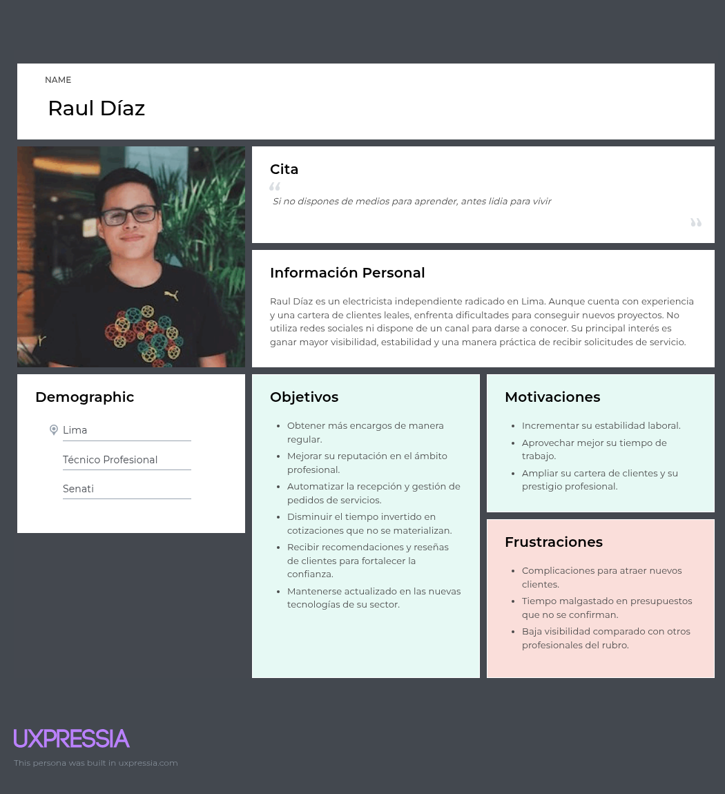

        **Segmento Objetivo 2: Clientes**
        
        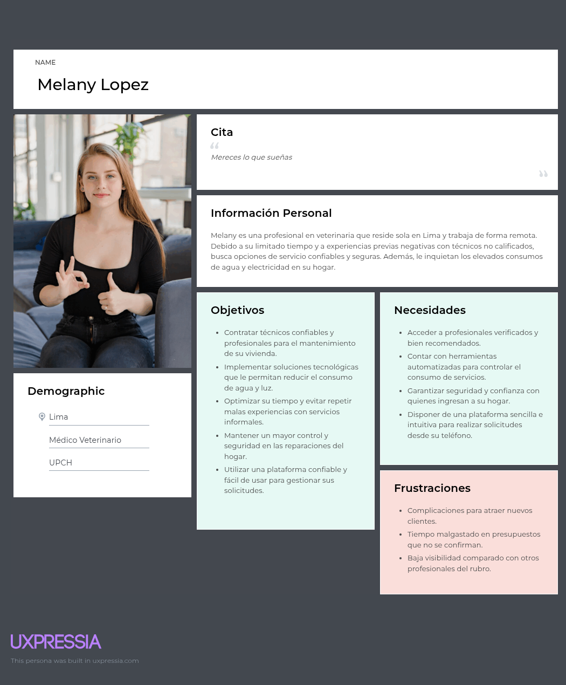
    - **2.3.2. User Task Matrix** 

      **Segmento Objetivo 1: Profesionales Tecnicos**

      | Tarea principal | Frecuencia | Importancia |
      |-----------------|------------|-------------|
      | Registrarse como técnico en la plataforma | Una vez | Alta |
      | Completar su perfil y subir certificaciones | Una vez | Alta |
      | Recibir notificaciones de nuevos servicios | Frecuente | Alta |
      | Aceptar o rechazar solicitudes de clientes | Frecuente | Alta |

       
       

      **Segmento Objetivo 2: Clientes**

      | Tarea principal | Frecuencia | Importancia |
      |-----------------|------------|-------------|
      | Buscar técnicos disponibles según ubicación y oficio | Frecuente | Alta |
      | Revisar perfiles y calificaciones de técnicos | Frecuente | Alta |
      | Recibir confirmación y agendar el servicio | Frecuente | Alta |
      | Calificar al técnico luego del servicio | Frecuente | Alta |
      | Monitorear consumo de agua y electricidad | Frecuente | Alta |

    - **2.3.3. User Journey Mapping**
    - **2.3.4. Empathy Mapping**

         **Segmento Objetivo 1: Profesionales Tecnicos**
        
        #### Fernando Silva
        ---    
          
        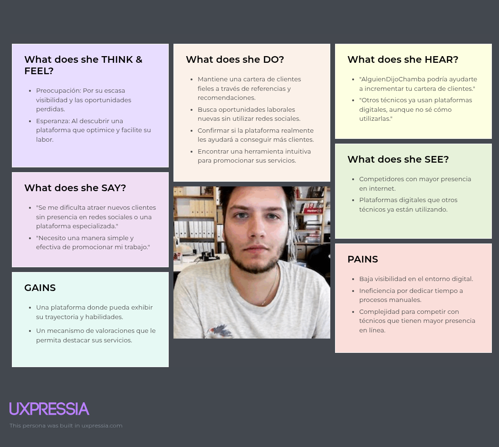

        **Segmento Objetivo 2: Clientes**

        #### Christian Martinez
        --- 
        
        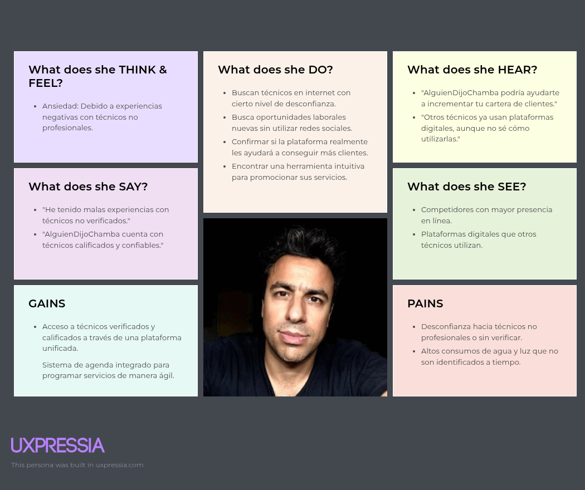
    - **2.3.5. As-is Scenario Mapping**
        
        **Segmento Objetivo 1: Profesionales Tecnicos**

        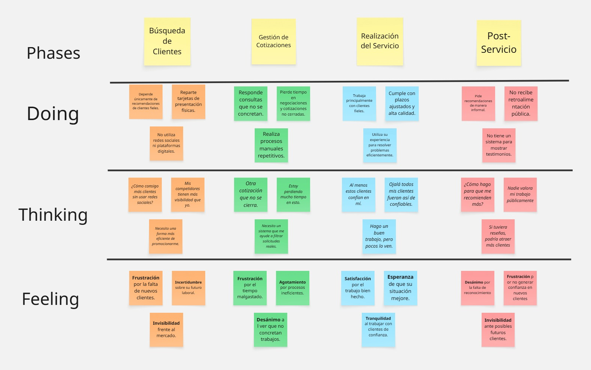

        **Segmento Objetivo 2: Clientes**
        
        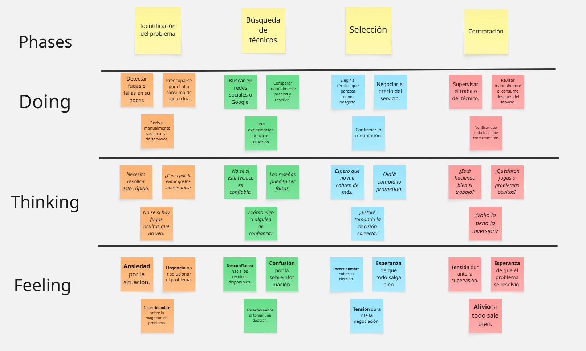
  - **2.4. Ubiquitous Language** 

    | Término en Inglés (Español) | Definición |
    |-----------------------------|------------|
    | **Account (Cuenta)** | Identidad digital de un usuario dentro de la plataforma. Incluye credenciales de acceso y estado de la cuenta. |
    | **User (Usuario)** | Entidad básica que representa a una persona registrada en la plataforma. Contiene información personal esencial. |
    | **Customer (Cliente)** | Usuario que solicita servicios técnicos o profesionales a través de la plataforma. |
    | **Worker (Trabajador Técnico)** | Profesional que ofrece servicios en la plataforma. Posee experiencia validada, habilidades técnicas y certificaciones. |
    | **Experience (Experiencia)** | Historial laboral de un trabajador técnico que respalda su trayectoria en distintos roles o empresas. |
    | **Review (Reseña)** | Calificación y comentario que un usuario emite sobre un servicio recibido o prestado. |
    | **Proposal (Propuesta)** | Oferta formal presentada por un trabajador técnico a un cliente. Contiene la descripción del trabajo, precio y tiempo estimado. |
    | **Chat (Chat)** | Canal de comunicación directa entre cliente y trabajador para coordinar detalles del servicio. |
    | **Message (Mensaje)** | Intercambio de comunicación individual dentro de un chat. |
    | **Sales Order Payment (Orden de Pago)** | Registro financiero de la transacción entre cliente y trabajador por los servicios acordados. |
    | **Ticket (Reclamo)** | Registro formal de una queja o disputa entre cliente y trabajador que requiere intervención de la plataforma. |
    | **Hourly Rate (Tarifa por Hora)** | Monto que un trabajador técnico define como su costo por hora de servicio. |
    | **Field (Campo de Especialidad)** | Área técnica específica en la que un trabajador se desempeña profesionalmente. |
    | **Skills (Habilidades)** | Conjunto de competencias técnicas y conocimientos que posee un trabajador. |

    - **2.4.1. User Stories**
      
    #Historias de Usuario para "Alguien Dijo Chamba"
    | **Epic / Story ID** | **Título** | **Descripción** | **Criterios de Aceptación** |
    |----------------------|------------|-----------------|-----------------------------|
    | **EP01** | Registro y Gestión de Perfil de Usuario | Como usuario (cliente o técnico) de Alguien Dijo Chamba, quiero crear, visualizar, editar y gestionar mi perfil para tener mis datos actualizados y poder utilizar la plataforma correctamente. | - **Escenario 1**: Al abrir la app por primera vez, puedo registrarme con un correo electrónico válido, una contraseña segura y mi ubicación. Los datos se guardan para que mi cuenta esté lista para usarse.   - **Escenario 2**: Si intento registrarme con un correo electrónico inválido o una contraseña débil, la app me muestra un mensaje de error indicando qué campos debo corregir. |
    | **EP02** | Búsqueda y Contacto de Profesionales | Como cliente, quiero buscar profesionales por especialidad, ubicación y reputación, y contactarlos fácilmente para solicitar sus servicios. | - **Escenario 1**: Al utilizar la app, puedo buscar fácilmente un profesional filtrando por su especialidad, ubicación y reputación.   - **Escenario 2**: Si no encuentro ningún profesional que coincida con mi búsqueda, la app me muestra un mensaje informándome que no hay resultados disponibles. |
    | **EP03** | Gestión de Servicios Técnicos (para Profesionales) | Como profesional técnico, quiero gestionar mi perfil de servicios, disponibilidad y recibir solicitudes de trabajo a través de la app. | - **Escenario 1**: Como técnico, puedo editar mi perfil directamente desde la app y añadir información sobre mis servicios, tarifas y horarios de disponibilidad.   - **Escenario 2**: Recibo notificaciones en mi móvil cuando un cliente me solicita un servicio, permitiéndome aceptar o rechazar el trabajo. |
    | **EP04** | Monitoreo Inteligente del Hogar (para Clientes) | Como cliente con el dispositivo IoT, quiero visualizar el consumo de agua y electricidad en tiempo real desde mi móvil y recibir alertas de posibles anomalías. | - **Escenario 1**: Desde la app, puedo ver en tiempo real mi consumo de agua y electricidad y recibir notificaciones de consumo excesivo.   - **Escenario 2**: Si el consumo supera los umbrales configurados, la app me envía una alerta para que pueda tomar medidas inmediatas. |
    | **EP05** | Gestión de Solicitudes y Contrataciones | Como cliente, quiero gestionar mis solicitudes de servicio, ver el estado de las contrataciones y realizar pagos de forma segura a través de la app. Como profesional, quiero gestionar las solicitudes recibidas y confirmar los trabajos. | - **Escenario 1**: Como cliente, puedo ver el estado de mis solicitudes de servicio y pagar directamente desde la app.   - **Escenario 2**: Como profesional, puedo revisar las solicitudes de los clientes y confirmar la disponibilidad o rechazar solicitudes. |
    | **EP06** | Sistema de Calificaciones y Reseñas | Como cliente, quiero calificar y dejar reseñas sobre los servicios o profesionales, y ver las calificaciones y reseñas de otros para tomar decisiones informadas. | - **Escenario 1**: Después de recibir un servicio, puedo calificar al profesional y dejar una reseña desde la app.   - **Escenario 2**: Puedo ver las calificaciones de otros clientes y las reseñas sobre un profesional para tomar una decisión informada. |
    | **US01** | Registro de Nuevo Usuario (Cliente) | Como nuevo cliente, quiero registrarme en la plataforma para poder buscar y contratar profesionales. | - **Escenario 1**: Cuando me registro en la app con un correo electrónico válido y una contraseña segura, mi cuenta de cliente se crea exitosamente.   - **Escenario 2**: Si intento registrarme con datos inválidos, la app me muestra un mensaje de error indicando qué debo corregir. |
    | **US02** | Registro de Nuevo Profesional Técnico | Como nuevo profesional técnico, quiero registrarme en la plataforma detallando mis especialidades, experiencia y datos de contacto para poder ofrecer mis servicios. | - **Escenario 1**: Puedo registrar mi perfil con mis especialidades, experiencia y datos de contacto a través de la app.   - **Escenario 2**: Si no completo todos los campos obligatorios, la app me indica qué información falta. |
    | **US03** | Editar Perfil de Usuario | Como usuario registrado (cliente o técnico), quiero poder editar la información de mi perfil (datos de contacto, ubicación, especialidades, tarifas, etc.) para mantenerla actualizada. | - **Escenario 1**: Puedo editar y guardar los datos de mi perfil en la app, y la información se actualiza correctamente.   - **Escenario 2**: Si intento guardar un número de teléfono con formato incorrecto, la app me muestra un mensaje de error. |
    | **US04** | Buscar Profesionales por Especialidad y Ubicación | Como cliente, quiero buscar profesionales filtrando por el tipo de servicio que necesito (ej. fontanero) y mi ubicación para encontrar opciones cercanas. | - **Escenario 1**: Al buscar un profesional en la app, puedo filtrar por especialidad y ubicación.   - **Escenario 2**: Si no hay profesionales disponibles en mi zona, la app me muestra un mensaje indicando que no se encontraron resultados. |
    | **US05** | Ver Perfil Detallado del Profesional | Como cliente, quiero ver el perfil de un profesional que incluye su experiencia, calificaciones, comentarios de otros usuarios y tarifas estimadas para evaluar su idoneidad. | - **Escenario 1**: Puedo ver el perfil completo de un profesional en la app, con detalles sobre su experiencia y tarifas. |
    | **US06** | Contactar al Profesional | Como cliente, quiero poder contactar directamente a un profesional a través de la plataforma (ej. enviar mensaje, solicitar cotización) para discutir mi necesidad y coordinar el servicio. | - **Escenario 1**: Desde el perfil de un profesional, puedo enviarle un mensaje para coordinar detalles del servicio.   - **Escenario 2**: Puedo solicitar una cotización a un profesional desde su perfil en la app. |            

    - **2.4.2. Impact Mapping**
    - **2.4.3. Product Backlog** 
        

    <table>
      <thead>
        <tr>
          <th># Orden</th>
          <th>User Story Id</th>
          <th>Título</th>
          <th>Story Points</th>
        </tr>
      </thead>
      <tbody>
        <tr><td>1</td><td>US01</td><td>Registro de Nuevo Usuario (Cliente)</td><td>5</td></tr>
        <tr><td>2</td><td>US02</td><td>Registro de Nuevo Profesional Técnico</td><td>5</td></tr>
        <tr><td>3</td><td>US03</td><td>Editar Perfil de Usuario</td><td>5</td></tr>
        <tr><td>4</td><td>US04</td><td>Buscar Profesionales por Especialidad y Ubicación</td><td>5</td></tr>
        <tr><td>5</td><td>US05</td><td>Ver Perfil Detallado del Profesional</td><td>5</td></tr>
        <tr><td>6</td><td>US06</td><td>Contactar al Profesional</td><td>5</td></tr>
        <tr><td>7</td><td>US07</td><td>Configurar Perfil de Servicios</td><td>5</td></tr>
        <tr><td>8</td><td>US08</td><td>Recibir y Gestionar Solicitudes de Servicio</td><td>5</td></tr>
        <tr><td>9</td><td>US09</td><td>Gestionar Disponibilidad</td><td>5</td></tr>
        <tr><td>10</td><td>US10</td><td>Visualizar Consumo de Agua y Electricidad</td><td>5</td></tr>
        <tr><td>11</td><td>US11</td><td>Realizar Pago del Servicio</td><td>5</td></tr>
        <tr><td>12</td><td>US12</td><td>Gestionar Solicitudes y Contrataciones</td><td>5</td></tr>
        <tr><td>13</td><td>US13</td><td>Calificar y Dejar Reseña (Cliente)</td><td>4</td></tr>
        <tr><td>14</td><td>US14</td><td>Ver Calificaciones y Reseñas de Profesionales</td><td>4</td></tr>
        <tr><td>15</td><td>US15</td><td>Suscribirse al Plan Premium</td><td>3</td></tr>
        <tr><td>16</td><td>US16</td><td>Configurar Dispositivo IoT</td><td>3</td></tr>
        <tr><td>17</td><td>US17</td><td>Vincular Dispositivo IoT a la Cuenta</td><td>3</td></tr>
        <tr><td>18</td><td>TS01</td><td>Visualizar Lista de Profesionales</td><td>3</td></tr>
        <tr><td>19</td><td>TS02</td><td>Registrar Nuevo Profesional</td><td>3</td></tr>
        <tr><td>20</td><td>TS03</td><td>Actualizar Perfil del Profesional</td><td>3</td></tr>
        <tr><td>21</td><td>TS04</td><td>Notificación de Nueva Solicitud de Servicio</td><td>3</td></tr>
        <tr><td>22</td><td>TS05</td><td>Envío de Mensaje al Profesional</td><td>3</td></tr>
        <tr><td>23</td><td>TS06</td><td>Envío de Solicitud de Cotización</td><td>3</td></tr>
        <tr><td>24</td><td>TS07</td><td>Visualización de Perfil Detallado</td><td>3</td></tr>
        <tr><td>25</td><td>TS08</td><td>Notificación de Solicitud de Servicio Aceptada</td><td>3</td></tr>
        <tr><td>26</td><td>TS09</td><td>Notificación de Solicitud de Servicio Rechazada</td><td>3</td></tr>
        <tr><td>27</td><td>TS10</td><td>Notificación de Disponibilidad Actualizada</td><td>3</td></tr>
        <tr><td>28</td><td>TS11</td><td>Visualización de Consumo en Tiempo Real</td><td>3</td></tr>
        <tr><td>29</td><td>TS12</td><td>Notificación de Consumo Excesivo</td><td>3</td></tr>
        <tr><td>30</td><td>TS13</td><td>Confirmación de Pago Exitoso</td><td>3</td></tr>
        <tr><td>31</td><td>TS14</td><td>Confirmación de Pago Fallido</td><td>3</td></tr>
        <tr><td>32</td><td>TS15</td><td>Visualización de Reseñas y Calificaciones</td><td>3</td></tr>
        <tr><td>33</td><td>TS16</td><td>Procesamiento de Solicitudes de Pago</td><td>3</td></tr>
        <tr><td>34</td><td>TS17</td><td>Suscripción a Plan Premium</td><td>3</td></tr>
        <tr><td>35</td><td>TS18</td><td>Guía de Configuración de Dispositivo IoT</td><td>3</td></tr>
        <tr><td>36</td><td>TS19</td><td>Vinculación Exitosa del Dispositivo IoT</td><td>3</td></tr>
      </tbody>
    </table>
    

  - **2.5. Strategic-Level Domain-Driven Design**
    - **2.5.1. EventStorming**
      - **2.5.1.1. Candidate Context Discovery**  
      - **2.5.1.2. Domain Message Flows Modeling**
      - **2.5.1.3. Bounded Context Canvases**
    - **2.5.2. Context Mapping**
    - **2.5.3. Software Architecture**
      - **2.5.3.1. Software Architecture Context Level Diagrams**
      - **2.5.3.2. Software Architecture Container Level Diagrams**
      - **2.5.3.3. Software Architecture Deployment Diagrams**
  - **2.6. Tactical-Level Domain-Driven Design**
    - **2.6.1. Bounded Context: Worker-Catalog**
      - **2.6.1.1. Domain Layer**
      - **2.6.1.2. Interface Layer**
      - **2.6.1.3. Application Layer**
      - **2.6.1.4. Infrastructure Layer**
      - **2.6.1.5. Bounded Context Software Architecture Component Level Diagrams**
      - **2.6.1.6. Bounded Context Software Architecture Code Level Diagrams**
        - **2.6.1.6.1. Bounded Context Domain Layer Class Diagrams**
        - **2.6.1.6.2. Bounded Context Database Design Diagram**
    - **2.6.2. Bounded Context: Payments**
      - **2.6.2.1. Domain Layer**  
      
        **Sub-capa Model:**

        | Tipo     | Nombre     | Descripción                                                                 | Responsabilidad Principal                                    | Relación con otros elementos                  |
        |----------|------------|-----------------------------------------------------------------------------|-------------------------------------------------------------|-----------------------------------------------|
        | Entity   | Payment    | Representa un pago realizado por un cliente a un técnico.                   | Gestionar información del pago (monto, estado, fecha).       | Relación con `Customer`, `Worker`, `Order`.   |
        | Entity   | Transaction| Registro detallado de la operación financiera.                             | Validar y asegurar consistencia de la transacción.           | Asociado a `Payment`.                         |
        | ValueObj | Amount     | Valor del monto a pagar en una transacción.                                | Garantizar formato, precisión y reglas de negocio de dinero. | Parte de `Payment` y `Transaction`.           |
        | Entity   | Order      | Representa el servicio acordado entre cliente y técnico.                   | Conectar el servicio contratado con su pago.                 | Relación con `Customer` y `Worker`.           |

        **Sub-capa Services**

        | Tipo      | Nombre             | Descripción                                                     | Responsabilidad Principal                           | Relación con otros elementos            |
        |-----------|--------------------|-----------------------------------------------------------------|----------------------------------------------------|-----------------------------------------|
        | Service   | PaymentService     | Lógica de negocio para procesar pagos y actualizarlos.           | Ejecutar, confirmar o rechazar pagos.               | Usa `PaymentRepository`, `Transaction`. |
        | Service   | RefundService      | Gestiona devoluciones de pagos.                                 | Permitir reembolsos y actualizar estados.           | Relación con `Payment`, `Order`.        |
        | Service   | ValidationService  | Reglas de validación de datos en el proceso de pago.            | Validar montos, usuarios y métodos de pago.         | Usado por `PaymentService`.             |
        
      - **2.6.2.2. Interface Layer**  

        **Sub-capa REST**
        | Tipo     | Nombre             | Descripción                                               | Responsabilidad Principal                          | Relación con otros elementos      |
        |----------|--------------------|-----------------------------------------------------------|---------------------------------------------------|-----------------------------------|
        | Endpoint | POST /payments     | Endpoint para crear un nuevo pago.                        | Registrar un pago asociado a una orden.            | Llama a `PaymentService`.         |
        | Endpoint | GET /payments/{id} | Obtiene detalles de un pago específico.                   | Consultar información del pago.                    | Usa `PaymentRepository`.           |
        | Endpoint | POST /refunds      | Procesa una solicitud de reembolso.                       | Ejecutar lógica de devolución de dinero.           | Llama a `RefundService`.           |

      - **2.6.2.3. Application Layer**  

        **Sub-capa Internal**
        | Tipo         | Nombre            | Descripción                                             | Responsabilidad Principal                          | Relación con otros elementos |
        |--------------|-------------------|---------------------------------------------------------|---------------------------------------------------|--------------------------------|
        | Use Case     | ProcessPayment    | Caso de uso para gestionar un pago desde inicio a fin.  | Coordinar servicios de validación y repositorio.   | `PaymentService`, `Transaction`.|
        | Use Case     | IssueRefund       | Caso de uso para ejecutar devolución de dinero.         | Coordinar validación, ejecución y actualización.   | `RefundService`.               |

        **Sub-capa External**
        | Tipo       | Nombre             | Descripción                                             | Responsabilidad Principal                          | Relación con otros elementos |
        |------------|--------------------|---------------------------------------------------------|---------------------------------------------------|--------------------------------|
        | Gateway    | PaymentGateway     | Integración con pasarela de pago externa (ej. Stripe).  | Conectar con sistemas externos de cobro.          | Llamado por `PaymentService`.  |  

      - **2.6.2.4. Infrastructure Layer** 

        **Sub-capa Repository**
        | Tipo         | Nombre               | Descripción                                             | Responsabilidad Principal                          | Relación con otros elementos |
        |--------------|----------------------|---------------------------------------------------------|---------------------------------------------------|--------------------------------|
        | Repository   | PaymentRepository    | Repositorio para CRUD de pagos.                        | Persistencia y consultas de la entidad `Payment`.  | Relación con `Database`.      |
        | Repository   | TransactionRepository| Repositorio para registros de transacciones.           | Guardar y recuperar `Transaction`.                 | Relación con `Database`.      |

      - **2.6.2.5. Bounded Context Software Architecture Component Level Diagrams**
        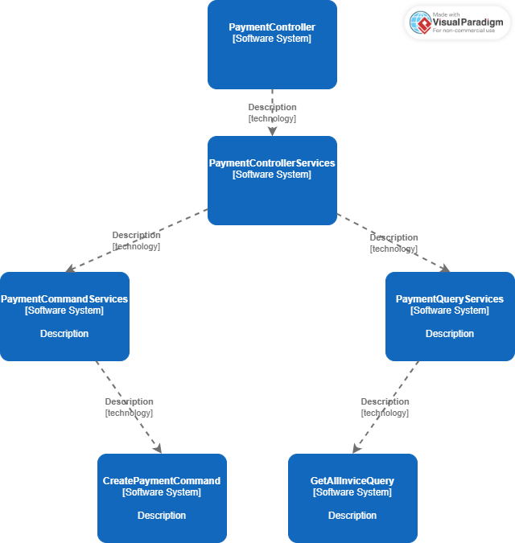

      - **2.6.2.6. Bounded Context Software Architecture Code Level Diagrams**
        - **2.6.2.6.1. Bounded Context Domain Layer Class Diagrams**
        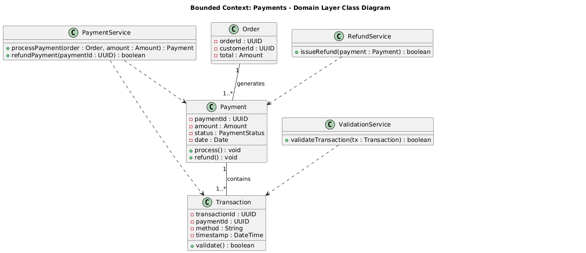
        - **2.6.2.6.2. Bounded Context Database Design Diagram**
        
    - **2.6.3. Bounded Context: Alerts**
    
      - **2.6.3.1. Domain Layer**
        
       **Sub-capa Model:**
        
       | Tipo         | Nombre                  | Descripción                                            | Responsabilidad Principal                             | Relación con otros elementos                                                                                                                                |
        |--------------|-------------------------|--------------------------------------------------------|-------------------------------------------------------|-------------------------------------------------------------------------------------------------------------------------------------------------------------|
        | Aggregate    | Alert                   | Clase para definir una Alerta de la aplicación         | Ser el punto de entrada para la gestion de Alertas    | Relacionado con el boundedContext de pagos para generar Alertas y el boundedContext de Tec-Section para generar una Alerta al momento de llamar a un Worker |
        | Value Object | AlertType               | Value object usado en el Aggregate Alert               | Representa el tipo de Alerta                          | Relacionado con Alert                                                                                                                                       |
        | Value Object | AlertTittle             | Value object usado en el Aggregate Alert               | Representa el titulo de la Alerta                     | Relacionado con Alert                                                                                                                                       |
        | Value Object | AlertMessage            | Value object usado en el Aggregate Alert               | Representa el contenido de la Alerta                  | Relacionado con Alert                                                                                                                                       |
        | Command      | CreateAlertCommand      | Comando para crear una Alerta                          | Encapsular los datos requeridos para crear una alerta | Usado cuando se quiere crear una alerta para el Worker y el Customer                                                                                        |
        | Command      | DeleteAlertCommand      | Comando para eliminar una Alert                        | Encapsular los datos para crear eliminar una alerta   | Verifica si el Worker  o el Customer  eliminan la alerta. Tambien si el Worker  rechaza una alerta esta se eliminara luego para este mismo.                 |
        | Command      | AcceptAlertCommand      | Comando para aceptar una Alert                         | Modificar informacion para aceptar una alerta         | Usado cuando el Worker  acepta el trabajo pedido por el Customer                                                                                            |
        | Command      | DeclineAlertCommand     | Comando para rechazar una Alert                        | Modificar informacion para rechazar una alerta        | Usado cuando el Worker  acepta el trabajo pedido por el Customer                                                                                            |
        | Query        | GetAlertByCustomerQuery | Consulta para obtener todas las alertas del Customer   | Recuperar las alertas del Usuario                     | Usado en la seccion de Alertas del Customer                                                                                                                 |
        | Query        | GetAlertByWorkerQuery   | Consulta para obtener todas las alertas del Worker     | Recuperar las alertas del Worker                      | Usado en la seccion de Alertas del Worker                                                                                                                   |
        
        **Sub-capa Service:**
    
      | Tipo      | Nombre              | Descripción                                     | Responsabilidad Principal                                        | Relación con otros elementos                                           |
      |-----------|---------------------|-------------------------------------------------|------------------------------------------------------------------|------------------------------------------------------------------------|
      | Interface | AlertCommandService | Servicio para comandos relacionados con Alert   | Declara métodos para crear, aceptar, rechazar o eliminar alertas | Implementado por  `AlertCommandServiceImp`. Usado en capa Application  |
      | Interface | AlertQueryService   | Servicio para consultas relacionadas con Alert  | Declarar métodos para filtrar por Customer o técnico             | Implementado por `AlertQueryServiceImpl`. Usado en capa de Application |

        - **2.6.3.2. Interface Layer**
        **Sub-capa REST**
      
          | Tipo       | Nombre                                   | Descripción                                                  | Responsabilidad Principal                                                                                                                  | Relación con otros elementos                                                             |
          |------------|------------------------------------------|--------------------------------------------------------------|--------------------------------------------------------------------------------------------------------------------------------------------|------------------------------------------------------------------------------------------|
          | Controller | AlertController                          | Controlador REST para gestionar Alertas                      | Recibir solicitudes tanto de Customer como de Worker sobre alertas, coordina los comandos correspondiente y devuelve la respuesta adecuada | Utiliza `AlertRequestResource`, `AlerResponseResource` y los assemblers correspondientes |
          | Resource   | AlertRequestResource                     | Estructura de una peticion para crear o modificar Alertas    | Representar y exponer datos del dominio de forma accesible y estructurada para el Cliente                                                  | Uso en `AlertController` para enviar datos estructurados al sistema                      |
          | Resource   | AlertResponseResource                    | Estructura de una respuesta con información de una alerta    | Representar y exponer datos del dominio de forma accesible y estructurada para el Cliente                                                  | Uso en `AlertController` para responder con datos del sistema                            |
          | Assembler  | CreateAlertCommandFromResourceAssembler  | Convierte un recurso de peticion en un `CreateAlertCommand`  | Evitar el acoplamiento entre la interfaz REST y la capa de aplicación                                                                      | Usado en `AlertController` para traducir la petición a `CreateAlertCommand`              |
          | Assembler  | DeleteAlertCommandFromResourceAssembler  | Convierte un recurso de petición en un `DeleteAlertCommand`  | Evitar el acoplamiento entre la interfaz REST y la capa de aplicación                                                                      | Usado en `AlertController` para traducir la petición a `DeleteAlertCommand`              |
          | Assembler  | AcceptAlertCommandFromResourceAssembler  | Convierte un recurso de petición en un `AcceptAlertCommand`  | Evitar el acoplamiento entre la interfaz REST y la capa de aplicación                                                                      | Usado en `AlertController` para traducir la petición a `AceceptAlertCommand`             |
          | Assembler  | DeclineAlertCommandFromResourceAssembler | Convierte un recurso de petición en un `DeclineAlertCommand` | Evitar el acoplamiento entre la interfaz REST y la capa de aplicación                                                                      | Usado en `AlertController` para traducir la petición a `DeclineAlertCommand`             |
          | Assembler  | AlertResourceFromEntityAssembler         | Convierte una entidad Alert en un recurso de respuesta       | Asegura una respuesta consistent para el cliente                                                                                           | Usado en `AlertController` para retornar `AlertResponseResource`                         |

      - **2.6.3.3. Application Layer**
        **Sub-capa Internal**
      
        | Tipo           | Nombre                  | Descripción                              | Responsabilidad Principal                                                                            | Relación con otros elementos                                                                    |
        |----------------|-------------------------|------------------------------------------|------------------------------------------------------------------------------------------------------|-------------------------------------------------------------------------------------------------|
        | CommandHandler | AlertCommandServiceImpl | Implementación de los comandos de Alert  | Implementar los métodos de crear, aceptar, rechazar y eliminar Alertas                               | Implementa la interfaz `AlertCommandService`. `AlertController` y `CommandHandlers` del dominio |
        | QueryHandler   | AlertQueryServiceImpl   | Implementación de las consultas de Alert | Implementar métodos para obtener alertas por ` GetAlertByCustomerQuery` y `GetAlertByWorkerQuery `   | Implementa la interfaz `AlerQueryService`. Usado por `AlertController` y lo Query  del dominio  |

      - **2.6.3.4. Infrastructure Layer**
        **Sub-capa Repository**
      
        | Tipo       | Nombre          | Descripción                            | Responsabilidad Principal                        | Relación con otros elementos                                                             |
        |------------|-----------------|----------------------------------------|--------------------------------------------------|------------------------------------------------------------------------------------------|
        | Repository | AlertRepository | Repositorio a usar del modelo "Alert"  | Acceder y manipular datos persistidos de Alertas | Usado en la capa Application para crear, aceptar, rechazar, eliminar y consultar alertas |
      
      - **2.6.3.5. Bounded Context Software Architecture Component Level Diagrams**
          
        El diagrama de componentes del Alert System muestra una arquitectura modular y bien definida. Los controladores gestionan la comunicación con los usuarios Customer y Worker, delegando la ejecución en los servicios de aplicación. Las entidades de dominio encapsulan la lógica central, mientras que los repositorios manejan la persistencia de datos. Este enfoque sigue los principios de DDD y Clean Architecture, garantizando separación de responsabilidades, mantenibilidad y facilidad de extensión del sistema.   
        

        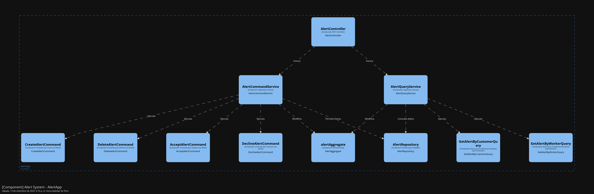
        

         
      - **2.6.3.6. Bounded Context Software Architecture Code Level Diagrams**
      
        - **2.6.3.6.1. Bounded Context Domain Layer Class Diagrams**
            
          Este diagrama UML representa la arquitectura de un sistema de gestión de alertas centrado en la administración de notificaciones entre Customers y Workers. La estructura está basada en principios de diseño orientado a objetos y se organiza en capas de comandos y consultas, siguiendo un enfoque CQRS . A lo largo del análisis, se describirán los principales componentes del sistema, como los servicios de comandos y consultas, la entidad central Alert, así como los value objects, los comandos y consultas asociados. También se explicará cómo estas clases interactúan entre sí mediante relaciones de herencia, interfaces, asociación y dependencia para mantener una lógica de negocio clara, desacoplada y mantenible.   
        

        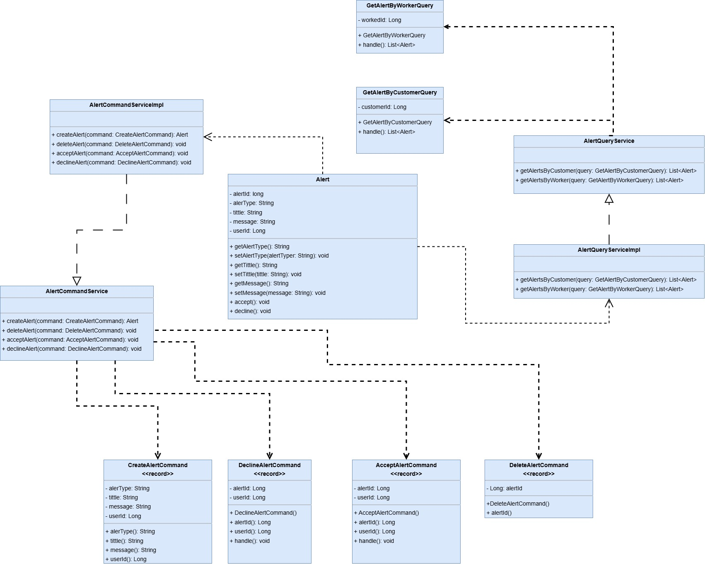
        

         
        
        - **2.6.3.6.2. Bounded Context Database Design Diagram**
            
        

        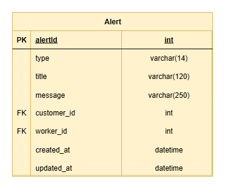
        

         
        
        **Tabla: Appointments**
      
        | Campo        | Tipo         | Descripción                      |
          |--------------|--------------|----------------------------------|
          | id           | int          | Identificador único de la alerta |
          | type         | varchar(14)  | Tipo de alerta                   |
          | title        | varchar(120) | Título de la alerta              |
          | message      | varchar(250) | Contenido de la alerta           |
          | customer_id  | int          | ID del Customer relacionado      |
          | worker_id    | int          | ID del Worker relacionado        |
          | created_at   | datetime     | Fecha de creación de la alerta   |
          | updated_at   | datetime     | Fecha de última actualización    |

    - **2.6.4. Bounded Context: Tec-Section**
      - **2.6.4.1. Domain Layer**
        
         **Sub-capa Model:**
        
| Tipo         | Nombre         | Descripción                                                         | Responsabilidad Principal                                   | Relación con otros elementos                                                                                  |
|--------------|----------------|---------------------------------------------------------------------|-------------------------------------------------------------|---------------------------------------------------------------------------------------------------------------|
| Aggregate    | WorkRequest    | Entidad que representa una solicitud de trabajo                     | Ser el punto de entrada para gestionar trabajos solicitados | Relacionado con WorkerProfile para asignar técnicos y con los servicios que manejan solicitudes               |
| Value Object | WorkStatus     | Value object dentro de WorkRequest                                  | Representa el estado del trabajo (pending, accepted, etc.)  | Relacionado con WorkRequest                                                                                    |
| Value Object | WorkDetails    | Value object dentro de WorkRequest                                  | Representa descripción final, monto y horario               | Relacionado con WorkRequest                                                                                    |
| Aggregate    | WorkerProfile  | Entidad que representa el perfil del técnico                        | Ser el punto de entrada para gestionar información de Worker | Relacionado con WorkRequest, ya que es quien recibe o acepta las solicitudes de trabajo                       |
| Value Object | WorkerStatus   | Value object dentro de WorkerProfile                                | Representa el estado del técnico (PENDING_APPROVAL, ACTIVE) | Relacionado con WorkerProfile                                                                                  |
| Value Object | WorkerContact  | Value object dentro de WorkerProfile                                | Contiene información de contacto como email y teléfono      | Relacionado con WorkerProfile                                                                                  |
| Command      | CreateWorkRequestCommand | Comando para crear una solicitud de trabajo          | Encapsular datos requeridos para generar un nuevo WorkRequest | Usado cuando un Customer registra un nuevo trabajo                                                                |
| Command      | UpdateWorkRequestCommand | Comando para actualizar datos de un WorkRequest     | Modificar datos como fecha, dirección o descripción         | Usado por el Customer antes de que un Worker lo acepte                                                               |
| Command      | AcceptWorkRequestCommand | Comando para aceptar un trabajo solicitado         | Modificar estado de WorkRequest a "accepted"                | Usado cuando un Worker acepta el trabajo                                                                              |
| Command      | CompleteWorkRequestCommand | Comando para marcar un trabajo como completado     | Modificar estado y registrar monto y descripción final      | Usado por el Worker al finalizar el servicio                                                                        |
| Query        | GetWorkRequestsByWorkerQuery | Consulta para obtener solicitudes por Worker      | Recuperar las solicitudes asignadas a un Worker             | Usado en la sección de solicitudes del Worker                                                                      |
| Query        | GetWorkRequestsByCustomerQuery | Consulta para obtener solicitudes por Customer    | Recuperar las solicitudes hechas por un Customer            | Usado en la sección de solicitudes del Customer                                                                  |

  **Sub-capa Service:**
    
| Tipo      | Nombre              | Descripción                                                    | Responsabilidad Principal                                                | Relación con otros elementos                                                                   |
|-----------|---------------------|----------------------------------------------------------------|----------------------------------------------------------------------------|----------------------------------------------------------------------------------------------|
| Service   | WorkRequestService  | Servicio simulado para manejar solicitudes de trabajo (mock).  | Retornar listado de solicitudes para un Worker o Customer (Observable).   | Usado en capa Application para renderizar en vistas de Worker y Customer                       |
| Service   | WorkerApiService    | Servicio para integrar con el backend vía API REST             | Gestionar Workers, Customers, categorías y solicitudes en la base de datos | Se comunica con la API (`/api/v1/workers`, `/api/v1/users`, `/api/v1/categories`). Consumido en capa Application |

  - **2.6.4.2. Interface Layer**
    **Sub-capa REST**
  
  | Tipo       | Nombre                                           | Descripción                                                              | Responsabilidad Principal                                                                                          | Relación con otros elementos                                                                 |
  |------------|--------------------------------------------------|--------------------------------------------------------------------------|--------------------------------------------------------------------------------------------------------------------|----------------------------------------------------------------------------------------------|
  | Controller | WorkRequestController                           | Controlador REST para gestionar solicitudes de trabajo                   | Recibir solicitudes de Customer (crear, actualizar, listar) y de Worker (aceptar, completar), y coordinar comandos | Utiliza `WorkRequestResource`, `WorkRequestResponseResource` y los assemblers correspondientes |
  | Controller | WorkerProfileController                         | Controlador REST para gestionar perfiles de técnicos                     | Exponer endpoints para registrar, actualizar y consultar información de Worker                                     | Utiliza `WorkerProfileResource`, `WorkerProfileResponseResource` y los assemblers correspondientes |
  | Resource   | WorkRequestResource                             | Estructura de una petición para crear o modificar un WorkRequest          | Representar datos del dominio (dirección, fecha, descripción, categoría, etc.) de forma accesible al Cliente        | Usado en `WorkRequestController` para recibir datos estructurados del Customer                 |
  | Resource   | WorkRequestResponseResource                     | Estructura de respuesta para un WorkRequest                              | Exponer estado, técnico asignado y detalles del trabajo en formato accesible                                        | Usado en `WorkRequestController` para responder con datos procesados                           |
  | Resource   | WorkerProfileResource                           | Estructura de petición para crear o modificar un perfil de Worker         | Representar datos como nombre, experiencia, contacto, categoría                                                     | Usado en `WorkerProfileController` para recibir información del Worker                        |
  | Resource   | WorkerProfileResponseResource                   | Estructura de respuesta para un perfil de Worker                          | Exponer datos del técnico en formato accesible (estado, disponibilidad, contacto)                                   | Usado en `WorkerProfileController` para responder con datos procesados                        |
  | Assembler  | CreateWorkRequestCommandFromResourceAssembler   | Convierte un recurso de petición en un `CreateWorkRequestCommand`         | Evitar acoplamiento entre la interfaz REST y la capa de aplicación                                                  | Usado en `WorkRequestController` para traducir la petición a comando                          |
  | Assembler  | UpdateWorkRequestCommandFromResourceAssembler   | Convierte un recurso de petición en un `UpdateWorkRequestCommand`         | Evitar acoplamiento entre REST y la capa de aplicación                                                              | Usado en `WorkRequestController`                                                              |
  | Assembler  | AcceptWorkRequestCommandFromResourceAssembler   | Convierte un recurso de petición en un `AcceptWorkRequestCommand`         | Traducir acción del Worker al comando correspondiente                                                              | Usado en `WorkRequestController`                                                              |
  | Assembler  | CompleteWorkRequestCommandFromResourceAssembler | Convierte un recurso de petición en un `CompleteWorkRequestCommand`       | Traducir acción de finalizar trabajo al comando correspondiente                                                     | Usado en `WorkRequestController`                                                              |
  | Assembler  | WorkRequestResourceFromEntityAssembler          | Convierte una entidad WorkRequest en un recurso de respuesta              | Asegurar respuesta consistente para el cliente                                                                      | Usado en `WorkRequestController` para retornar `WorkRequestResponseResource`                   |
  | Assembler  | WorkerProfileResourceFromEntityAssembler        | Convierte una entidad WorkerProfile en un recurso de respuesta            | Asegurar respuesta consistente para el cliente                                                                      | Usado en `WorkerProfileController` para retornar `WorkerProfileResponseResource`               |
  
- **2.6.4.3. Application Layer**
  **Sub-capa Internal**
  
  | Tipo           | Nombre                           | Descripción                                          | Responsabilidad Principal                                                                 | Relación con otros elementos                                                                 |
  |----------------|----------------------------------|------------------------------------------------------|-------------------------------------------------------------------------------------------|----------------------------------------------------------------------------------------------|
  | CommandHandler | WorkRequestCommandServiceImpl    | Implementación de los comandos de WorkRequest        | Implementar métodos para crear, actualizar, aceptar y completar solicitudes de trabajo     | Implementa la interfaz `WorkRequestCommandService`. Usado por `WorkRequestController` y los CommandHandlers del dominio |
  | QueryHandler   | WorkRequestQueryServiceImpl      | Implementación de las consultas de WorkRequest       | Implementar métodos para obtener solicitudes por estado, cliente o técnico                 | Implementa la interfaz `WorkRequestQueryService`. Usado por `WorkRequestController` y los QueryHandlers del dominio       |
  | CommandHandler | WorkerProfileCommandServiceImpl  | Implementación de los comandos de WorkerProfile      | Implementar métodos para registrar y actualizar perfiles de técnicos                      | Implementa la interfaz `WorkerProfileCommandService`. Usado por `WorkerProfileController` y los CommandHandlers del dominio |
  | QueryHandler   | WorkerProfileQueryServiceImpl    | Implementación de las consultas de WorkerProfile     | Implementar métodos para consultar perfiles por categoría, disponibilidad, experiencia     | Implementa la interfaz `WorkerProfileQueryService`. Usado por `WorkerProfileController` y los QueryHandlers del dominio   |

- **2.6.4.4. Infrastructure Layer**
  **Sub-capa Repository**
  
  | Tipo       | Nombre                  | Descripción                                   | Responsabilidad Principal                                              | Relación con otros elementos                                                                 |
  |------------|-------------------------|-----------------------------------------------|------------------------------------------------------------------------|----------------------------------------------------------------------------------------------|
  | Repository | WorkRequestRepository   | Repositorio para el modelo `WorkRequest`      | Acceder y manipular datos persistidos de solicitudes de trabajo        | Usado en la capa Application por `WorkRequestCommandServiceImpl` y `WorkRequestQueryServiceImpl` |
  | Repository | WorkerProfileRepository | Repositorio para el modelo `WorkerProfile`    | Acceder y manipular datos persistidos de perfiles de técnicos          | Usado en la capa Application por `WorkerProfileCommandServiceImpl` y `WorkerProfileQueryServiceImpl` |

    - **2.6.4.5. Bounded Context Software Architecture Component Level Diagrams**
   
       El diagrama de componentes de Tec Section muestra la organización del sistema en dos módulos principales: WorkRequest y WorkerProfile, cada uno compuesto por cuatro elementos con responsabilidades específicas. Los Controllers cumplen el rol de exponer datos, actuando como interfaz REST para que los actores externos (Customer y Worker) interactúen con la aplicación. Los Services se encargan de ejecutar datos, orquestando la lógica de negocio mediante la creación, actualización y finalización de solicitudes. Los Resources permiten consultar datos, garantizando que la información del dominio se estructure y presente de manera consistente para su consumo. Finalmente, los Repositories se responsabilizan de modificar datos, encapsulando la persistencia y asegurando independencia entre el dominio y la infraestructura. Esta división modular garantiza claridad en las responsabilidades, bajo acoplamiento y facilidad de mantenimiento, siguiendo los principios de DDD y Clean Architecture.
        

        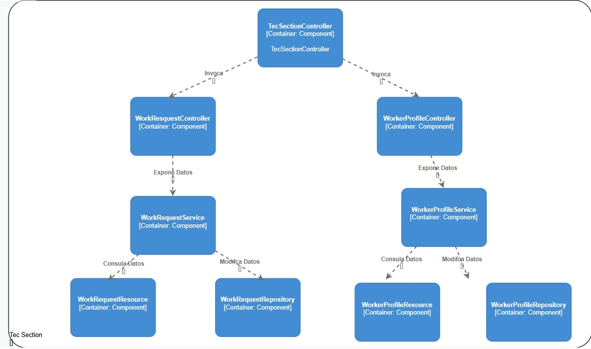
        

         
    - **2.6.4.6. Bounded Context Software Architecture Code Level Diagrams**
   - **2.6.4.6.1. Bounded Context Domain Layer Class Diagrams**
          
        Este diagrama UML representa la arquitectura de un sistema de gestión técnica centrado en la administración de secciones de trabajo, solicitudes de servicio y la interacción entre clientes (Customers) y técnicos (Technicians), teniendo como entidad principal a TecSection, la cual coordina la relación entre técnicos, solicitudes y servicios. Los principales componentes incluyen: Technician y Customer como actores principales, ServiceRequest como núcleo de la interacción entre cliente y técnico, Invoice y Payment para la gestión de facturación y cobros, Category para agrupar técnicos por especialidad, Review para la retroalimentación del cliente y Admin como supervisor del sistema. Las relaciones reflejan la lógica del dominio, donde un Customer puede generar múltiples solicitudes que se asignan a un Technician dentro de una TecSection, cada solicitud puede generar facturas y pagos, y los clientes pueden dejar reseñas sobre el servicio recibido. En conjunto, este diseño permite un sistema modular, escalable y mantenible, con una clara separación de responsabilidades que facilita su evolución futura.   
        

        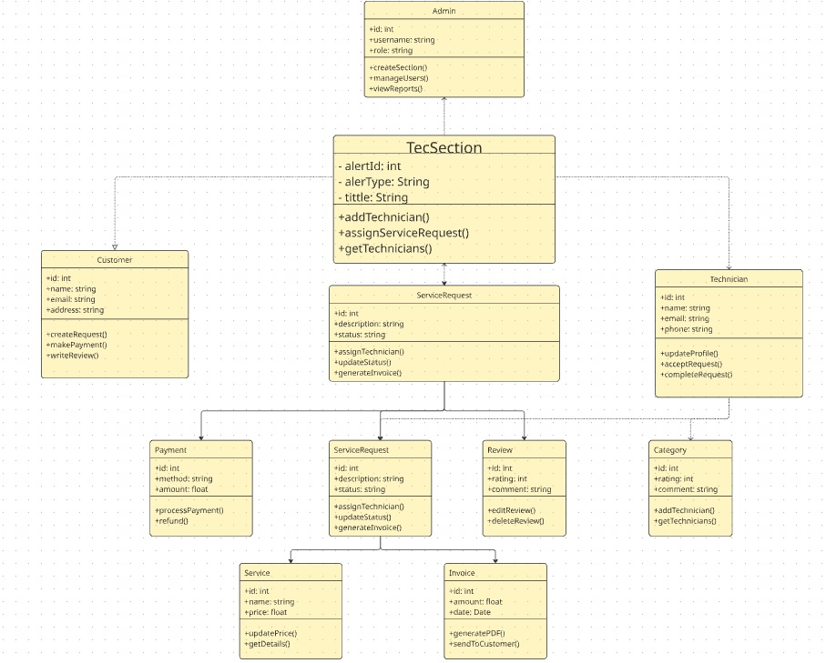
        

         
    - **2.6.4.6.2. Bounded Context Database Design Diagram**
    
  

  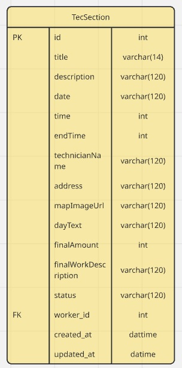
  

   
  
  **Tabla: WorkRequest**
  
  | Campo              | Tipo           | Descripción                                         |
  |--------------------|----------------|-----------------------------------------------------|
  | id                 | varchar(36)    | Identificador único de la solicitud (PK)            |
  | title              | varchar(120)   | Título de la solicitud de trabajo                   |
  | description        | varchar(300)   | Detalle de la solicitud                             |
  | date               | datetime       | Fecha en la que se realizará el servicio            |
  | time               | varchar(20)    | Hora programada del inicio del servicio             |
  | endTime            | varchar(20)    | Hora estimada de finalización                       |
  | technicianName     | varchar(120)   | Nombre del técnico asignado o del cliente           |
  | address            | varchar(200)   | Dirección donde se realizará el trabajo             |
  | mapImageUrl        | varchar(250)   | URL del mapa de referencia                          |
  | dayText            | varchar(20)    | Texto descriptivo del día (Hoy, Mañana, etc.)       |
  | finalAmount        | decimal(10,2)  | Monto final del servicio acordado                   |
  | finalWorkDescription | varchar(250) | Descripción final del trabajo realizado             |
  | status             | varchar(15)    | Estado de la solicitud (pending, accepted, etc.)    |
  | worker_id          | int            | ID del Worker relacionado (FK)                      |
  | created_at         | datetime       | Fecha de creación de la solicitud                   |
  | updated_at         | datetime       | Fecha de última actualización de la solicitud       |

