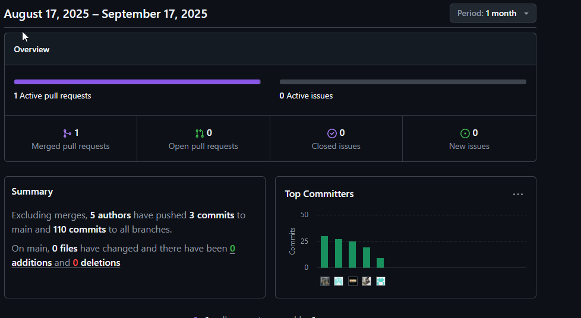
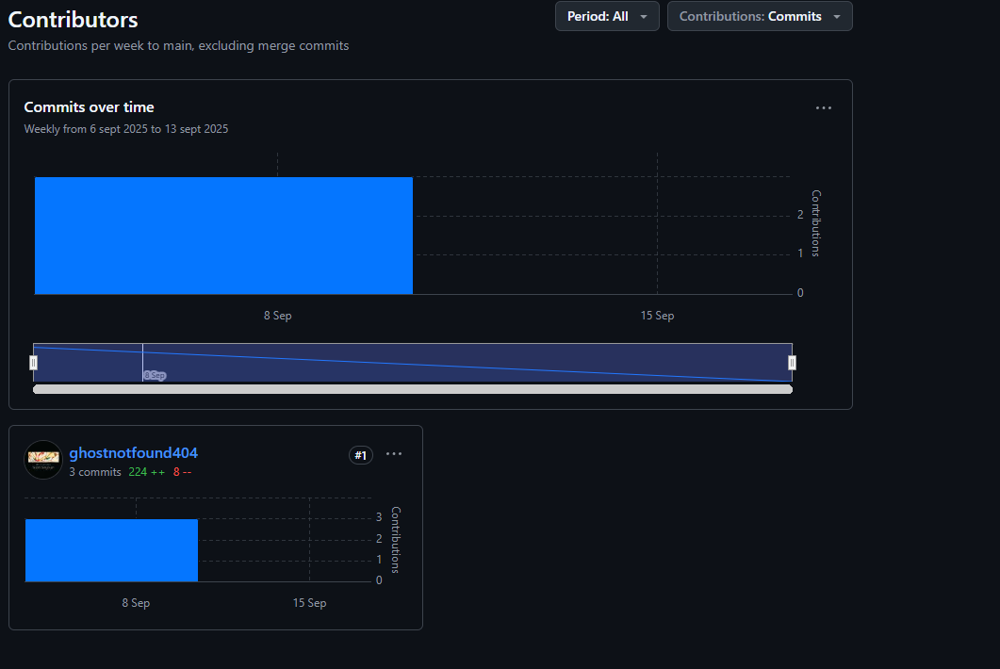
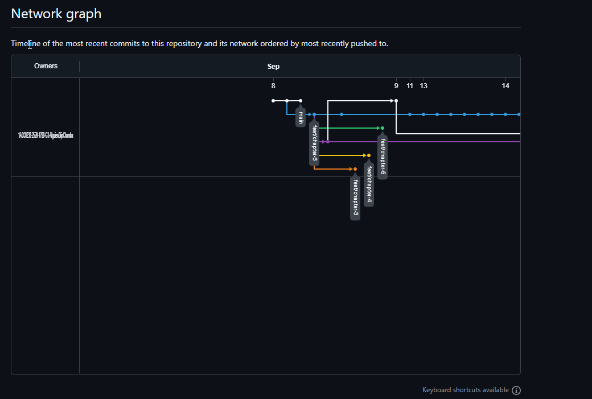

# COURSE PROJECT

---

    <strong>Universidad Peruana de Ciencias Aplicadas (UPC)</strong>     
    </img> 
    <strong>Carrera de Ingeniería de Software - Ciclo VI</strong>  
    <strong>Aplicaciones para Dispositivos Móviles - 1798</strong> 
     <strong>Profesor: Jorge Luis Mayta Guillermo</strong> 
     <strong><b>INFORME DEL TRABAJO FINAL</strong></b> 

    <strong>Startup del Proyecto: The Draws</strong> 
    <strong>Producto: AlguienDijoChamba</strong> 

    <h3 align="center">Team Members:</h3>

    <table align="center">
        <tr>
            <th style="text-align:center;">Member</th>
            <th style="text-align:center;">Code</th>
        </tr>
        <tr>
            <td>Bastidas Bastidas, Diego Martin</td>
            <td>U20221A301</td>
        </tr>
        <tr>
            <td>Belahonia Miranda, Fabrisio  </td>
            <td>U202220219</td>
        </tr>
        <tr>
            <td>Dominguez Vargas, Rafael Alexander</td>
            <td>u202312318</td>
        </tr>
        <tr>
            <td>Escobar Palomino, Sebastian Matias</td>
            <td>U202220219</td>
        </tr>
        <tr>
            <td>Muñiz Huayanca, Percy Alonso</td>
            <td>u202319563</td>
        </tr>
    </table>
    

</body>

 <strong>2025-02</strong>

 

---

# Registro de Versiones del Informe

| Versión | Fecha | Autor | Descripción de la modificación |
|----|----|----|----|
| TB1 | 17/09/2025 | Diego Bastidas, Fabrisio Belahonia, Rafael Dominguez, Sebastian Escobar, Alonso Muñiz | Redacción de los Capítulos I: Presentación, II: Requirements Development and Software Solution Design |

# Project Report Collaboration Insights

Enlace de la organización para el reporte del proyecto: https://github.com/1ACC0238-2520-1798-G3-AlguienDijoChamba 

# Contenido
## Tabla de contenidos
- [**Registro de Versiones del Informe**](#registro-de-versiones-del-informe)
- [**Project Report Collaboration Insights**](#project-report-collaboration-insights)
- [**Contenido**](#contenido)
    - [Tabla de contenidos](#tabla-de-contenidos)
- [**Student Outcome**](#student-outcome)
- ## [ **Capítulo I:  Presentación** ](#-capítulo-i-introducción-)

# Student Outcome
| Criterio específico | Acciones realizadas | Conclusiones |
|----|----|----|
|Actualiza conceptos y conocimientos necesarios para su desarrollo profesional y en especial para su proyecto en soluciones de ingeniería de software| **Diego Bastidas:** En el Capítulo I, participé activamente en la redacción de la presentación del proyecto, la descripción de la startup y la elaboración de los perfiles de los integrantes. En el Capítulo II, colaboré en el análisis competitivo y en la especificación de requisitos, contribuyendo a la definición de user stories y la estructura del backlog.  **Fabrisio Belahonia:** En el Capítulo I, apoyé en la elaboración del perfil de la startup y la identificación de la problemática. En el Capítulo II, participé en el diseño y análisis de entrevistas, así como en la construcción de user personas y el mapeo de la experiencia del usuario.  **Rafael Dominguez:** En el Capítulo I, ayudé en la redacción de la solución propuesta y la identificación de los segmentos objetivo. En el Capítulo II, colaboré en la especificación de requisitos y en la documentación de la arquitectura de software.  **Sebastian Escobar:** En el Capítulo I, contribuí en la elaboración de los antecedentes y la problemática. En el Capítulo II, participé en el análisis de competidores y en la definición de la arquitectura de alto nivel.  **Alonso Muñiz:** En el Capítulo I, participé en la descripción de los perfiles de los integrantes y la presentación general. En el Capítulo II, apoyé en la elaboración de la matriz de tareas de usuario y en la documentación de los contextos de dominio.|La actualización constante de conceptos y conocimientos en ingeniería de software nos permitió abordar de manera efectiva los retos de los capítulos 1 y 2, aplicando metodologías actuales y mejores prácticas para el desarrollo del proyecto y nuestro crecimiento profesional.|

 

---

| Criterio específico | Acciones realizadas | Conclusiones |
|----|----|----|
|Reconoce la necesidad del aprendizaje permanente para el desempeño profesional y el desarrollo de proyectos en soluciones de tecnologías de ingeniería de software.| **Diego Bastidas:** En el Capítulo I, participé activamente en la presentación del proyecto y la descripción de la startup, lo que me llevó a investigar nuevas tendencias en emprendimientos tecnológicos. En el Capítulo II, colaboré en el análisis competitivo y la especificación de requisitos, actualizando mis conocimientos sobre metodologías ágiles y herramientas de documentación.  **Fabrisio Belahonia:** En el Capítulo I, apoyé en la elaboración del perfil de la startup y la identificación de la problemática, lo que me motivó a buscar información sobre casos similares y soluciones innovadoras. En el Capítulo II, participé en el diseño y análisis de entrevistas, así como en la construcción de user personas, reforzando la importancia de la empatía y el aprendizaje continuo sobre experiencia de usuario.  **Rafael Dominguez:** En el Capítulo I, ayudé en la redacción de la solución propuesta y la identificación de los segmentos objetivo, investigando sobre segmentación de mercado y modelos de negocio. En el Capítulo II, colaboré en la especificación de requisitos y en la documentación de la arquitectura de software, lo que me impulsó a actualizarme en patrones de diseño y buenas prácticas de ingeniería.  **Sebastian Escobar:** En el Capítulo I, contribuí en la elaboración de los antecedentes y la problemática, investigando tendencias actuales del sector. En el Capítulo II, participé en el análisis de competidores y en la definición de la arquitectura de alto nivel, lo que me llevó a profundizar en herramientas de modelado y análisis de competencia.  **Alonso Muñiz:** En el Capítulo I, participé en la descripción de los perfiles de los integrantes y la presentación general, buscando referentes en equipos multidisciplinarios. En el Capítulo II, apoyé en la elaboración de la matriz de tareas de usuario y en la documentación de los contextos de dominio, lo que me motivó a aprender sobre técnicas de análisis de usuario y modelado de dominios.|El aprendizaje permanente ha sido fundamental para adaptarnos a los retos de los capítulos 1 y 2, permitiéndonos incorporar nuevas metodologías, herramientas y enfoques en el desarrollo del proyecto, y preparándonos para un desempeño profesional competente y actualizado en ingeniería de software.|

 

----

